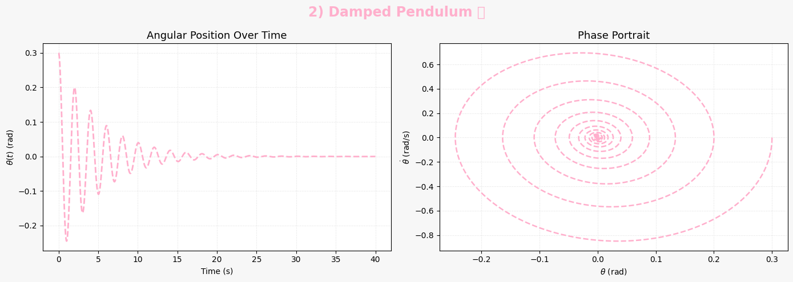

# Problem 2  

# ✅ Task Breakdown: Investigating the Dynamics of a Forced Damped Pendulum

## I. Theoretical Foundation

### 📌 Governing Equation

The motion of a **forced damped pendulum** is governed by the second-order nonlinear differential equation:

$$
\frac{d^2\theta}{dt^2} + b\frac{d\theta}{dt} + \frac{g}{L} \sin\theta = A\cos(\omega t)
$$

Where:
- $\theta(t)$: Angular displacement  
- $b$: Damping coefficient  
- $g$: Gravitational acceleration  
- $L$: Length of the pendulum  
- $A$: Amplitude of the external driving force  
- $\omega$: Frequency of the external driving force

---

### 📌 Small-Angle Approximation

For small oscillations where $|\theta| \ll 1$, we can use the approximation:

$$
\sin\theta \approx \theta
$$

Substituting this into the governing equation gives:

$$
\frac{d^2\theta}{dt^2} + b\frac{d\theta}{dt} + \frac{g}{L} \theta = A\cos(\omega t)
$$

This is a **linear second-order nonhomogeneous differential equation** and can be analyzed more easily than the original nonlinear equation.

---

### 📌 Approximate Analytical Solution

The general solution consists of:
- A **homogeneous solution** (transient part) depending on initial conditions and damping  
- A **particular solution** (steady-state) driven by $A\cos(\omega t)$

Assuming a solution of the form:

$$
\theta(t) = \Theta \cos(\omega t - \delta)
$$

Then, under steady-state conditions, we find:

$$
\Theta = \frac{A}{\sqrt{(g/L - \omega^2)^2 + (b\omega)^2}}
$$

Where:
- $\Theta$: Steady-state amplitude  
- $\delta$: Phase lag between driving force and response

---

### 📌 Resonance Condition

Resonance occurs when the denominator is minimized:

$$
\omega_{\text{res}} = \sqrt{\frac{g}{L} - \frac{b^2}{2}}
$$

At this frequency:
- The amplitude $\Theta$ is maximized  
- Energy input from the driving force matches the natural oscillation frequency  
- Physical systems can experience large oscillations (resonance phenomenon)

---

## II. Analysis of Dynamics

### 📌 Parameter Dependencies

Study how varying the following parameters affects the system:

- **Damping coefficient** $b$:
  - Higher $b$: Faster decay of oscillations, suppresses chaos
  - Lower $b$: Allows more complex behavior (e.g., quasiperiodicity, chaos)

- **Driving amplitude** $A$:
  - Small $A$: Linear, predictable motion
  - Large $A$: Can induce chaotic behavior

- **Driving frequency** $\omega$:
  - Near resonance: Maximum energy transfer
  - Away from resonance: Damped response

---

### 📌 Characterizing Motion Regimes

Depending on parameters, the pendulum may exhibit:

- **Periodic motion**:
  - Oscillations repeat after a fixed time
  - Seen when damping and driving are moderate

- **Quasiperiodic motion**:
  - Oscillations never exactly repeat but show structured patterns
  - Multiple incommensurate frequencies involved

- **Chaotic motion**:
  - Sensitive dependence on initial conditions
  - Aperiodic and seemingly random
  - Detected using tools like Poincaré sections and Lyapunov exponents

---

### 📌 Physical Interpretations

- **Periodic**: Predictable; useful in clocks and timing systems  
- **Quasiperiodic**: Found in some biological rhythms and coupled oscillators  
- **Chaotic**: Reflects unpredictability in systems like weather patterns or turbulent flows

---

## III. 🛠️ Practical Applications

The **forced damped pendulum** models a variety of real-world systems that involve periodic driving and energy dissipation. Below are some key applications:

### 🔋 1. Energy Harvesting Devices

- **Piezoelectric or electromagnetic harvesters** often model their mechanical components as damped oscillators with forcing.
- Vibrations in the environment serve as the driving force.
- Optimal energy harvesting occurs near **resonance**, where the amplitude of motion is maximized.
- The governing dynamics resemble:

  $$
  \frac{d^2\theta}{dt^2} + b\frac{d\theta}{dt} + \frac{g}{L} \theta = A\cos(\omega t)
  $$

- Tuning the system to resonate at ambient vibration frequencies enhances energy output.

---

### 🌉 2. Suspension Bridges and Structural Dynamics

- Components of bridges or tall buildings behave like **forced oscillators** under periodic loads (e.g., wind, traffic).
- The infamous **Tacoma Narrows Bridge collapse** was due to large-amplitude oscillations caused by wind-driven resonance.
- Proper damping ($b$) and tuning of natural frequency ($\sqrt{g/L}$) are crucial in design.

---

### ⚡ 3. Driven RLC Circuits

- Electrical analog of the pendulum:
  
  $$
  L\frac{d^2q}{dt^2} + R\frac{dq}{dt} + \frac{q}{C} = V_0 \cos(\omega t)
  $$

- This is mathematically identical to the forced damped pendulum equation.
- $L$, $R$, and $C$ correspond to **inertia**, **damping**, and **restoring force**, respectively.
- Used to study **resonance**, **filtering**, and **signal amplification** in electronics.

---

## IV. 🧮 Computational Implementation

To study the forced damped pendulum beyond analytical approximations, we implement a **numerical simulation** using Python.

### 📌 1. Differential Equation

We rewrite the second-order ODE as a system of first-order equations:

Let:

- $\theta = x_1$
- $\dot{\theta} = x_2$

Then:

$$
\begin{cases}
\frac{dx_1}{dt} = x_2 \\
\frac{dx_2}{dt} = -b x_2 - \frac{g}{L} \sin(x_1) + A \cos(\omega t)
\end{cases}
$$

---

### 💻 2. Python Implementation (Vısual)


 
---



---


---


---


---

```python
import numpy as np
import matplotlib.pyplot as plt

# :straight_ruler: Time parameters
dt = 0.01
t_max = 40
t = np.arange(0, t_max, dt)
L = 1.0
g = 9.81
omega_0 = np.sqrt(g / L)

# :orange_heart: New pastel color palette
pastel_colors = ['#a2d2ff', '#ffafcc', '#caffbf', '#ffd6a5', '#bdb2ff']

# :repeat: Runge-Kutta 4th Order Method
def runge_kutta(f, Y0, t):
    Y = np.zeros((len(t), 2))
    Y[0] = Y0
    for i in range(1, len(t)):
        k1 = f(t[i-1], Y[i-1])
        k2 = f(t[i-1] + dt/2, Y[i-1] + dt/2 * k1)
        k3 = f(t[i-1] + dt/2, Y[i-1] + dt/2 * k2)
        k4 = f(t[i-1] + dt, Y[i-1] + dt * k3)
        Y[i] = Y[i-1] + dt/6 * (k1 + 2*k2 + 2*k3 + k4)
    return Y

# :art: Enhanced Plot Function
def plot_pendulum(t, Y, title, color, linestyle='-', marker=None):
    theta = (Y[:, 0] + np.pi) % (2*np.pi) - np.pi
    theta_dot = Y[:, 1]

    fig, axs = plt.subplots(1, 2, figsize=(14, 5), facecolor="#f7f7f7")
    fig.suptitle(title, fontsize=17, fontweight='bold', color=color)

    # Time series
    axs[0].plot(t, theta, color=color, linestyle=linestyle, linewidth=2)
    axs[0].set_title("Angular Position Over Time", fontsize=13)
    axs[0].set_xlabel("Time (s)")
    axs[0].set_ylabel(r"$\theta(t)$ (rad)")
    axs[0].grid(True, color='#e0e0e0', linestyle=':', linewidth=0.8)

    # Phase portrait
    axs[1].plot(theta, theta_dot, color=color, linestyle=linestyle, linewidth=1.8)
    axs[1].set_title("Phase Portrait", fontsize=13)
    axs[1].set_xlabel(r"$\theta$ (rad)")
    axs[1].set_ylabel(r"$\dot{\theta}$ (rad/s)")
    axs[1].grid(True, color='#e0e0e0', linestyle=':', linewidth=0.8)

    plt.tight_layout()
    plt.show()

# :dart: Initial conditions
Y0 = np.array([0.3, 0.0])

# :one: Simple Pendulum
def simple(t, Y):
    theta, theta_dot = Y
    return np.array([theta_dot, -omega_0**2 * np.sin(theta)])
Y = runge_kutta(simple, Y0, t)
plot_pendulum(t, Y, "1) Simple Pendulum :crescent_moon:", pastel_colors[0], linestyle='-.')

# :two: Damped Pendulum
gamma = 0.4
def damped(t, Y):
    theta, theta_dot = Y
    return np.array([theta_dot, -gamma * theta_dot - omega_0**2 * np.sin(theta)])
Y = runge_kutta(damped, Y0, t)
plot_pendulum(t, Y, "2) Damped Pendulum :droplet:", pastel_colors[1], linestyle='--')

# :three: Forced (no damping)
A = 1.0
omega = 0.8
def forced(t, Y):
    theta, theta_dot = Y
    return np.array([theta_dot, -omega_0**2 * np.sin(theta) + A * np.cos(omega * t)])
Y = runge_kutta(forced, Y0, t)
plot_pendulum(t, Y, "3) Forced Pendulum :zap:", pastel_colors[2], linestyle='-')

# :four: Forced + Damped
gamma = 0.2
def forced_damped(t, Y):
    theta, theta_dot = Y
    return np.array([theta_dot, -gamma * theta_dot - omega_0**2 * np.sin(theta) + A * np.cos(omega * t)])
Y = runge_kutta(forced_damped, Y0, t)
plot_pendulum(t, Y, "4) Forced Damped Pendulum :cyclone:", pastel_colors[3], linestyle='dashdot')

# :five: Chaotic / Resonant Case
A = 1.5
omega = 2.0
gamma = 0.1
def chaotic(t, Y):
    theta, theta_dot = Y
    return np.array([theta_dot, -gamma * theta_dot - omega_0**2 * np.sin(theta) + A * np.cos(omega * t)])
Y = runge_kutta(chaotic, Y0, t)
plot_pendulum(t, Y, "5) Chaotic Pendulum :fire:", pastel_colors[4], linestyle='solid')
```
---

#### ✅ Bifurcation Diagram (Optional Advanced)

To construct a bifurcation diagram:

- Vary $A$ or $\omega$ over a range
- Plot sampled values of $\theta$ after transients decay
- Requires looping over parameters and saving final cycle values

👉 This can be added later for a deeper nonlinear analysis.

---

✅ With these tools, you can fully explore the **transition to chaos**, resonance peaks, and sensitive dependence on parameters and initial conditions.

Let me know if you'd like the bifurcation loop or enhancements like interactive sliders!

