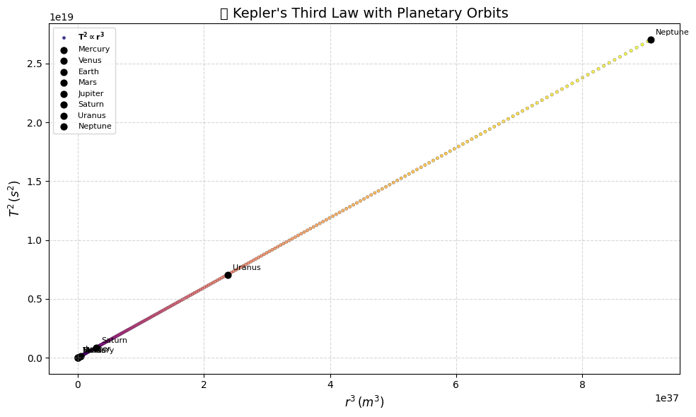
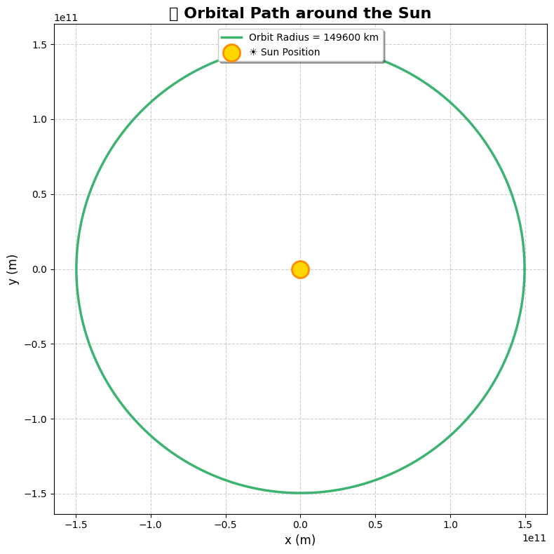

# 🌍 Deriving Masses and Cosmic Velocities Using Kepler’s Laws

## 📘 Problem 1: Mass Determination via Kepler’s Third Law

### 🧠 Kepler’s Third Law for Circular Orbits

> **"The square of the orbital period ($T$) is proportional to the cube of the orbital radius ($r$)."**

Derived using Newton’s Law of Gravitation and centripetal motion:

#### Step 1: Equating Forces

Gravitational force:
$$
F_g = \frac{GMm}{r^2}
$$

Centripetal force:
$$
F_c = \frac{mv^2}{r}
$$

Equating both:

$$
\frac{GMm}{r^2} = \frac{mv^2}{r}
$$

Cancel $m$, solve for $v$:
$$
v = \sqrt{\frac{GM}{r}}
$$

#### Step 2: Expression for Orbital Period

Orbital period:
$$
T = \frac{2\pi r}{v} = 2\pi \sqrt{\frac{r^3}{GM}}
$$

✅ **Kepler’s Third Law (Final Form):**
$$
T^2 = \frac{4\pi^2}{GM}r^3
$$

---

### 🌍 Mass of the Earth via Moon’s Orbit

Rearranging Kepler’s Law:
$$
M = \frac{4\pi^2 r^3}{G T^2}
$$

Given:
- $r = 3.84 \times 10^8$ m  
- $T = 27.3$ days = $2.36 \times 10^6$ s  
- $G = 6.67430 \times 10^{-11}$ m³/kg·s²

Plug values:
$$
M_\text{Earth} \approx 5.97 \times 10^{24} \, \text{kg}
$$

---

### ☀️ Mass of the Sun via Earth’s Orbit

Given:
- $r = 1.496 \times 10^{11}$ m  
- $T = 1$ year = $3.154 \times 10^7$ s  

Apply the same formula:
$$
M_\text{Sun} = \frac{4\pi^2 r^3}{G T^2} \approx 1.99 \times 10^{30} \, \text{kg}
$$

---

## 🧪 Python Simulation of Circular Orbits



---

```python
import numpy as np
import matplotlib.pyplot as plt

# Constants
G = 6.67430e-11  # gravitational constant (m^3 kg^-1 s^-2)
M = 1.989e30     # mass of the Sun (kg)

# Orbital radii (in meters) — from 0.3 AU to 30 AU
radii = np.linspace(0.3, 30, 300) * 1.496e11

# Calculate orbital periods using Kepler's Third Law
T = 2 * np.pi * np.sqrt(radii**3 / (G * M))

# Prepare figure
plt.figure(figsize=(10, 6))
colors = plt.cm.plasma(np.linspace(0, 1, len(radii)))  # Gradient color map

# Plot with colorful dots
plt.scatter(radii**3, T**2, c=colors, s=10, edgecolor='black', linewidth=0.2, alpha=0.8, label=r'$\mathbf{T^2 \propto r^3}$')

# Real Solar System planets (approximate data)
planet_data = {
    'Mercury': (0.39, 0.24),
    'Venus': (0.72, 0.62),
    'Earth': (1.0, 1.0),
    'Mars': (1.52, 1.88),
    'Jupiter': (5.20, 11.86),
    'Saturn': (9.58, 29.46),
    'Uranus': (19.22, 84.01),
    'Neptune': (30.05, 164.8)
}

# Plot planet points
for planet, (r_au, T_years) in planet_data.items():
    r3 = (r_au * 1.496e11) ** 3
    T2 = (T_years * 365.25 * 24 * 3600) ** 2
    plt.scatter(r3, T2, color='black', s=40, marker='o', label=planet)
    plt.annotate(planet, (r3, T2), textcoords="offset points", xytext=(5, 5), fontsize=8)

# Axis labels
plt.xlabel(r'$r^3 \, (m^3)$', fontsize=12)
plt.ylabel(r'$T^2 \, (s^2)$', fontsize=12)
plt.title('🌍 Kepler\'s Third Law with Planetary Orbits', fontsize=14)
plt.grid(True, linestyle='--', alpha=0.5)

# Custom legend
handles, labels = plt.gca().get_legend_handles_labels()
by_label = dict(zip(labels, handles))  # Remove duplicates
plt.legend(by_label.values(), by_label.keys(), fontsize=8, loc='upper left')

plt.tight_layout()
plt.show()
```
## 🚀 Problem 2: Cosmic Velocities

### 🧠 Definitions

1. **First Cosmic Velocity**: Minimum speed for a circular orbit at the surface of a celestial body.
$$
v_1 = \sqrt{\frac{GM}{r}}
$$

2. **Second Cosmic Velocity**: Escape velocity from a celestial body.
$$
v_2 = \sqrt{\frac{2GM}{r}}
$$

3. **Third Cosmic Velocity** (**Corrected**): Speed required to escape the **Sun’s** gravitational field from Earth orbit.

>❌ Incorrect:  
>$$ v_3 = \sqrt{\frac{3GM}{r}} $$  
>(This is not physically derived and must not be used.)

>✅ Correct:
>$$
>v_3 = \sqrt{\frac{2GM_\text{Sun}}{r}}
>$$

From Earth’s orbit:
- $v_\text{Earth orbit} \approx 29.78$ km/s  
- $v_3 \approx \sqrt{2} \cdot 29.78 \approx 42.1$ km/s

---

## 📊 Summary Table: Velocities for Earth

| Velocity Type         | Formula                        | Approx. Value |
|-----------------------|--------------------------------|----------------|
| First Cosmic Velocity | $v_1 = \sqrt{GM/r}$            | ~7.9 km/s      |
| Second Cosmic Velocity| $v_2 = \sqrt{2GM/r}$           | ~11.2 km/s     |
| Third Cosmic Velocity | $v_3 = \sqrt{2GM_\odot/r}$     | ~42.1 km/s     |

---

## 🔍 Notes

- All derivations assume **circular orbits** and **point mass central fields**.
- Kepler's Law assumes a two-body system where one mass is significantly larger.
- The third cosmic velocity depends on the **relative location** in the Sun's gravitational well, and cannot be universally simplified.

## 🧪 Python Code for Calculations and Visualization



---

```python
import numpy as np
import matplotlib.pyplot as plt

# Constants
AU = 1.496e11  # 1 Astronomical Unit in meters (average Earth-Sun distance)
radius = AU

# Create theta array for orbit (0 to 2π)
theta = np.linspace(0, 2 * np.pi, 1000)

# Parametric equations for the circular orbit
x = radius * np.cos(theta)
y = radius * np.sin(theta)

# Plotting
plt.figure(figsize=(8, 8))
plt.plot(x, y, color='mediumseagreen', linewidth=2.5, label=f'Orbit Radius = {radius/1e6:.0f} km')
plt.scatter(0, 0, color='gold', s=300, label='☀️ Sun Position', edgecolors='darkorange', linewidths=2, zorder=5)

# Styling
plt.title('🌍 Orbital Path around the Sun', fontsize=16, weight='bold')
plt.xlabel('x (m)', fontsize=12)
plt.ylabel('y (m)', fontsize=12)
plt.grid(True, linestyle='--', alpha=0.6)
plt.axis('equal')
plt.legend(loc='upper center', fontsize=10, frameon=True, shadow=True)

# Optional: dark background (uncomment if you want it)
# plt.style.use('dark_background')

plt.tight_layout()
plt.show()
```


## 📌 References

- Newton, I. *Principia Mathematica*  
- NASA: Planetary Fact Sheets  
- OpenStax Physics Textbook 


