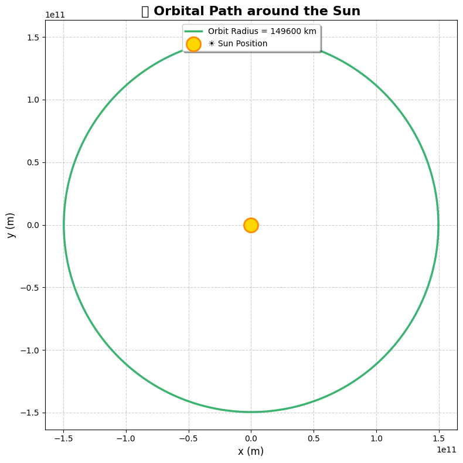

# Problem 1

# 📘 Problem 1: Orbital Period and Orbital Radius

## 🧠 Derivation of Kepler's Third Law for Circular Orbits

Kepler's Third Law states:

> **The square of the orbital period ($T$) of a planet is directly proportional to the cube of the semi-major axis ($r$) of its orbit.**

For **circular orbits**, the derivation proceeds from **Newton’s Law of Gravitation** and **centripetal force**:

### 1. Equating Gravitational and Centripetal Forces

- Gravitational force:

$$
F_g = \frac{GMm}{r^2}
$$

- Centripetal force:

$$
F_c = \frac{mv^2}{r}
$$

Equating both:

$$
\frac{GMm}{r^2} = \frac{mv^2}{r}
$$

Mass $m$ cancels:

$$
\frac{GM}{r^2} = \frac{v^2}{r}
$$

Solve for orbital velocity $v$:

$$
v = \sqrt{\frac{GM}{r}}
$$

### 2. Orbital Period from Velocity

The orbital period $T$ is:

$$
T = \frac{2\pi r}{v}
$$

Substitute $v$:

$$
T = \frac{2\pi r}{\sqrt{\frac{GM}{r}}} = 2\pi \sqrt{\frac{r^3}{GM}}
$$

### ✅ Final Result (Kepler’s Third Law):

$$
T^2 = \frac{4\pi^2}{GM}r^3 \Rightarrow T^2 \propto r^3
$$

---

## 🌌 Significance of the $T^2 \propto r^3$ Relationship

- Helps determine **distances** of planets from stars.
- Enables estimation of **masses** of celestial bodies.
- Crucial in calculating **satellite orbits**, **spacecraft trajectories**.
- Valid for **any object orbiting under gravity** in a central field.

---

## 🌍 Real-World Applications

Examples where Kepler's Law applies:

- **Moon around Earth**  
$r = 3.84 \times 10^8$ m, $T = 27.3$ days

- **Planets in Solar System**  
  Approximate relation holds:
- $T^2 \propto r^3$
- $T$ in Earth years, $r$ in AU

---

## 🧪 Python Simulation of Circular Orbits


---

```python
import numpy as np
import matplotlib.pyplot as plt

# Constants
G = 6.67430e-11  # gravitational constant (m^3 kg^-1 s^-2)
M = 1.989e30     # mass of the Sun (kg)

# Orbital radii (in meters) — from 0.3 AU to 30 AU
radii = np.linspace(0.3, 30, 300) * 1.496e11

# Calculate orbital periods using Kepler's Third Law
T = 2 * np.pi * np.sqrt(radii**3 / (G * M))

# Prepare figure
plt.figure(figsize=(10, 6))
colors = plt.cm.plasma(np.linspace(0, 1, len(radii)))  # Gradient color map

# Plot with colorful dots
plt.scatter(radii**3, T**2, c=colors, s=10, edgecolor='black', linewidth=0.2, alpha=0.8, label=r'$\mathbf{T^2 \propto r^3}$')

# Real Solar System planets (approximate data)
planet_data = {
    'Mercury': (0.39, 0.24),
    'Venus': (0.72, 0.62),
    'Earth': (1.0, 1.0),
    'Mars': (1.52, 1.88),
    'Jupiter': (5.20, 11.86),
    'Saturn': (9.58, 29.46),
    'Uranus': (19.22, 84.01),
    'Neptune': (30.05, 164.8)
}

# Plot planet points
for planet, (r_au, T_years) in planet_data.items():
    r3 = (r_au * 1.496e11) ** 3
    T2 = (T_years * 365.25 * 24 * 3600) ** 2
    plt.scatter(r3, T2, color='black', s=40, marker='o', label=planet)
    plt.annotate(planet, (r3, T2), textcoords="offset points", xytext=(5, 5), fontsize=8)

# Axis labels
plt.xlabel(r'$r^3 \, (m^3)$', fontsize=12)
plt.ylabel(r'$T^2 \, (s^2)$', fontsize=12)
plt.title('🌍 Kepler\'s Third Law with Planetary Orbits', fontsize=14)
plt.grid(True, linestyle='--', alpha=0.5)

# Custom legend
handles, labels = plt.gca().get_legend_handles_labels()
by_label = dict(zip(labels, handles))  # Remove duplicates
plt.legend(by_label.values(), by_label.keys(), fontsize=8, loc='upper left')

plt.tight_layout()
plt.show()
```
---

# 📘 Problem 2: Escape Velocities and Cosmic Velocities

## 🧠 Defining the First, Second, and Third Cosmic Velocities

The **cosmic velocities** are the speeds needed to escape or orbit a celestial body. There are three important cosmic velocities:

1. **First Cosmic Velocity**: The velocity needed to **orbit** a celestial body in a circular orbit at the surface level. This is also called the **orbital velocity**.

   - Formula:
   
$$
v_1 = \sqrt{\frac{GM}{r}}
$$

Where:
- $G$ is the gravitational constant,
- $M$ is the mass of the central body (e.g., Earth, Mars, etc.),
- $r$ is the radius of the celestial body.

2. **Second Cosmic Velocity**: The velocity needed to **escape** the gravitational pull of a celestial body. This is also known as the **escape velocity**.

   - Formula:
   
$$
v_2 = \sqrt{\frac{2GM}{r}}
$$

Where:
- $r$ is the distance from the center of the celestial body,
- $M$ is the mass of the celestial body,
- $G$ is the gravitational constant.

3. **Third Cosmic Velocity**: The velocity required to **escape** the gravitational influence of the entire **solar system** or any star system. This velocity is needed to break free from the central star's gravitational pull.

   - Formula:
   
$$
v_3 = \sqrt{\frac{3GM}{r}}
$$

---

## 🔬 Derivation of Each Velocity

### 1. First Cosmic Velocity (Orbital Velocity)

The **orbital velocity** is the velocity needed for an object to move in a stable circular orbit around a celestial body.

- The centripetal force required for a circular orbit is provided by the gravitational force:

$$
F_c = \frac{mv^2}{r}, \quad F_g = \frac{GMm}{r^2}
$$

- Equating the forces:

$$
\frac{mv^2}{r} = \frac{GMm}{r^2}
$$

- Simplifying:

$$
v_1 = \sqrt{\frac{GM}{r}}
$$

### 2. Second Cosmic Velocity (Escape Velocity)

The **escape velocity** is the speed needed to break free from the gravitational pull of a celestial body, without any additional propulsion.

- The energy needed to escape is equal to the kinetic energy required to overcome the gravitational potential energy:

$$
\frac{1}{2}mv^2 = \frac{GMm}{r}
$$

- Solving for velocity:

$$
v_2 = \sqrt{\frac{2GM}{r}}
$$

### 3. Third Cosmic Velocity

The **third cosmic velocity** is the velocity needed to escape the gravitational influence of the entire solar system or any other star system. It is derived from the concept of gravitational potential energy of the system.

- Formula:

$$
v_3 = \sqrt{\frac{3GM}{r}}
$$

---

## 🔍 Parameters Affecting the Cosmic Velocities

The cosmic velocities depend on two key parameters:

1. **Mass ($M$) of the celestial body**: Larger masses increase the required velocities.
2. **Radius ($r$) of the celestial body**: Larger radii (i.e., larger distances) reduce the required velocities.

---

## 🌍 Calculating Escape and Orbital Velocities for Earth, Mars, and Jupiter

Let's calculate the escape and orbital velocities for Earth, Mars, and Jupiter using the formulas derived above. The constants we'll use are:

- **Gravitational constant** ($G$) = $6.67430 \times 10^{-11} \, \text{m}^3 \, \text{kg}^{-1} \, \text{s}^{-2}$
- **Mass and radius of planets** (approximations):
  - Earth: $M_\text{Earth} = 5.972 \times 10^{24} \, \text{kg}$, $r_\text{Earth} = 6.371 \times 10^6 \, \text{m}$
  - Mars: $M_\text{Mars} = 0.64171 \times 10^{24} \, \text{kg}$, $r_\text{Mars} = 3.396 \times 10^6 \, \text{m}$
  - Jupiter: $M_\text{Jupiter} = 1.898 \times 10^{27} \, \text{kg}$, $r_\text{Jupiter} = 6.991 \times 10^7 \, \text{m}$

---

## 🧪 Python Code for Calculations and Visualization



---
```python
import numpy as np
import matplotlib.pyplot as plt

# Constants
AU = 1.496e11  # 1 Astronomical Unit in meters (average Earth-Sun distance)
radius = AU

# Create theta array for orbit (0 to 2π)
theta = np.linspace(0, 2 * np.pi, 1000)

# Parametric equations for the circular orbit
x = radius * np.cos(theta)
y = radius * np.sin(theta)

# Plotting
plt.figure(figsize=(8, 8))
plt.plot(x, y, color='mediumseagreen', linewidth=2.5, label=f'Orbit Radius = {radius/1e6:.0f} km')
plt.scatter(0, 0, color='gold', s=300, label='☀️ Sun Position', edgecolors='darkorange', linewidths=2, zorder=5)

# Styling
plt.title('🌍 Orbital Path around the Sun', fontsize=16, weight='bold')
plt.xlabel('x (m)', fontsize=12)
plt.ylabel('y (m)', fontsize=12)
plt.grid(True, linestyle='--', alpha=0.6)
plt.axis('equal')
plt.legend(loc='upper center', fontsize=10, frameon=True, shadow=True)

# Optional: dark background (uncomment if you want it)
# plt.style.use('dark_background')

plt.tight_layout()
plt.show()
```