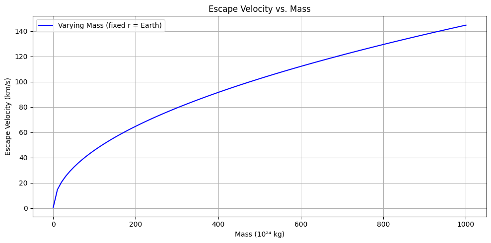
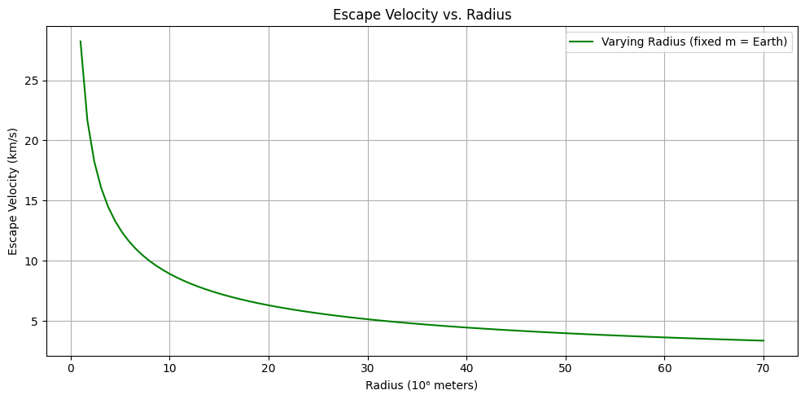
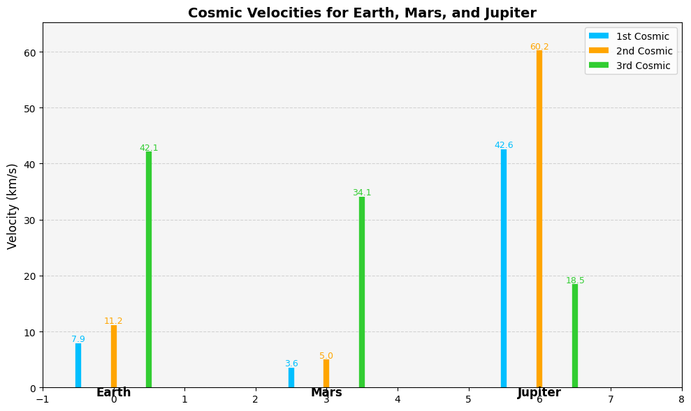
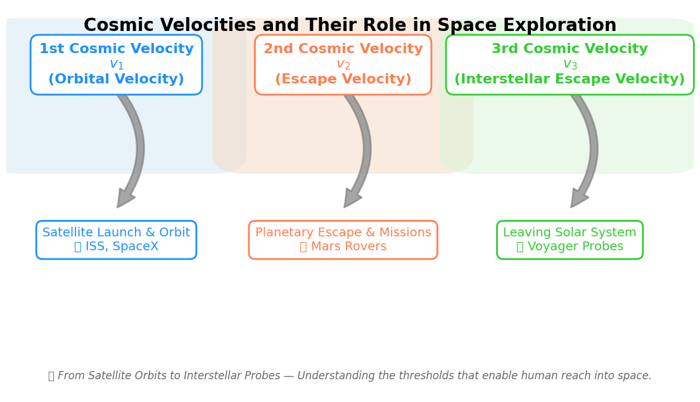

# Problem 2

# Escape Velocities and Cosmic Velocities

## Define the Concepts

### 🚀 First Cosmic Velocity — Orbital Velocity

- **Definition**: The minimum velocity required for a body to stay in a stable circular orbit around a celestial object (like Earth) without propulsion.
- **Physical Meaning**:
  - At this speed, the gravitational pull provides exactly the centripetal force needed for circular motion.
  - A satellite moving at this speed remains in orbit just above the surface.

### 🌍 Second Cosmic Velocity — Escape Velocity

- **Definition**: The minimum velocity needed to break free from the gravitational field of a celestial body without further propulsion.
- **Physical Meaning**:
  - If a spacecraft reaches this velocity, it will escape the planet's gravity and not return, unless acted upon by another force.
  - It is **independent of the direction** of launch (ignoring atmosphere and rotation).

### 🌌 Third Cosmic Velocity — Interstellar Escape Velocity

- **Definition**: The minimum velocity required to escape the gravitational influence of the entire star system (e.g., Sun + planets).
- **Physical Meaning**:
  - This is the speed needed to leave the **solar system entirely**.
  - Used in planning interstellar missions like **Voyager 1 & 2**.

---

## 📐 Mathematical Analysis

### 1️⃣ First Cosmic Velocity (Orbital Velocity)

- Derived from equating centripetal force and gravitational force:

$$
\frac{mv^2}{r} = \frac{GMm}{r^2}
$$

- Solving for $v$:

$$
v_1 = \sqrt{\frac{GM}{r}}
$$

- **Parameters**:
- $G$: Gravitational constant
- $r$: Radius from center of mass (typically planet’s radius for low orbit)

---

### 2️⃣ Second Cosmic Velocity (Escape Velocity)




---




---


- Derived from conservation of energy:
  - Total mechanical energy at escape = 0 (kinetic = gravitational potential energy)

$$
\frac{1}{2}mv^2 = \frac{GMm}{r}
\Rightarrow v_2 = \sqrt{\frac{2GM}{r}}
$$

- **Note**: $v_2 = \sqrt{2} \cdot v_1$

---

### 3️⃣ Third Cosmic Velocity (Interstellar Escape)

- More complex derivation involving solar system dynamics.
- Escape velocity from Sun at Earth's orbit:

$$
v_3 = \sqrt{\frac{2GM_{\odot}}{r_{\text{Earth}}}}
$$

- If starting from Earth, subtract Earth's orbital velocity (~29.78 km/s):

$$
v_{3,\text{from Earth}} = v_3 - v_{\text{Earth orbit}}
$$

---

### 📊 Parameter Effects

- **Mass ($M$)**: Directly increases velocity — more massive body requires more speed to escape.
- **Radius ($r$)**: Inversely proportional — closer to center means stronger gravity, hence higher velocity.
- **Gravitational constant ($G$)**: A fixed universal constant.

---

### 🔁 Comparison Table

| Velocity Type        | Formula                            | Depends On                  |
|----------------------|-------------------------------------|------------------------------|
| First Cosmic ($v_1$)     | $\sqrt{\frac{GM}{r}}$               | Mass, Radius                |
| Second Cosmic ($v_2$)    | $\sqrt{\frac{2GM}{r}}$              | Mass, Radius                |
| Third Cosmic ($v_3$)     | $\sqrt{\frac{2GM_{\odot}}{r}}$      | Sun's Mass, Distance        |


# 🌌 Cosmic Velocities – Calculations and Visualizations

## 🎯 Objective

- Calculate the **first**, **second**, and **third cosmic velocities** for the following celestial bodies:
  - Earth
  - Mars
  - Jupiter
- Create visualizations to compare these velocities across planets.

---

## 🧮 Formulas Used

- Gravitational constant: $G = 6.67430 \times 10^{-11} \, \mathrm{m^3\,kg^{-1}\,s^{-2}}$

### 1️⃣ First Cosmic Velocity – Orbital Velocity

- Equation:
$$
v_1 = \sqrt{\frac{GM}{r}}
$$

### 2️⃣ Second Cosmic Velocity – Escape Velocity

- Equation:
$$
v_2 = \sqrt{\frac{2GM}{r}}
$$

### 3️⃣ Third Cosmic Velocity – Interstellar Escape (from Sun)

- Equation:
$$
v_3 = \sqrt{\frac{2GM_{\odot}}{R_{\text{orbit}}}}
$$

---

## 🧠 Parameters

- $M$: Mass of the planet
- $r$: Radius of the planet
- $M_{\odot}$: Mass of the Sun
- $R_{\text{orbit}}$: Distance from Sun (orbital radius of the planet)

---

## 🐍 Python-Visual Code



---


```python
import numpy as np
import matplotlib.pyplot as plt

# Constants
G = 6.67430e-11  # Gravitational constant (m^3 kg^-1 s^-2)
M_sun = 1.989e30  # kg

# Planetary data
planets = {
    'Earth': {'mass': 5.972e24, 'radius': 6.371e6, 'orbit_radius': 1.496e11},
    'Mars': {'mass': 6.4171e23, 'radius': 3.3895e6, 'orbit_radius': 2.279e11},
    'Jupiter': {'mass': 1.898e27, 'radius': 6.9911e7, 'orbit_radius': 7.785e11}
}

# Storage
planet_names = []
v1_values = []
v2_values = []
v3_values = []

# Calculation
for name, data in planets.items():
    M = data['mass']
    r = data['radius']
    R_orbit = data['orbit_radius']
    
    v1 = np.sqrt(G * M / r)
    v2 = np.sqrt(2 * G * M / r)
    v3 = np.sqrt(2 * G * M_sun / R_orbit)
    
    planet_names.append(name)
    v1_values.append(v1 / 1000)  # km/s
    v2_values.append(v2 / 1000)
    v3_values.append(v3 / 1000)

# Set up better visualization
fig, ax = plt.subplots(figsize=(10, 6))
ax.set_facecolor('whitesmoke')
colors = ['deepskyblue', 'orange', 'limegreen']

x_positions = np.arange(len(planet_names)) * 3  # spacing between planets

# Plot each velocity as a vertical line ("tower")
for i, name in enumerate(planet_names):
    xpos = x_positions[i]
    ax.vlines(xpos - 0.5, 0, v1_values[i], color=colors[0], lw=6, label='1st Cosmic' if i == 0 else "")
    ax.vlines(xpos,       0, v2_values[i], color=colors[1], lw=6, label='2nd Cosmic' if i == 0 else "")
    ax.vlines(xpos + 0.5, 0, v3_values[i], color=colors[2], lw=6, label='3rd Cosmic' if i == 0 else "")
    
    # Add labels
    ax.text(xpos - 0.5, v1_values[i] + 0.3, f"{v1_values[i]:.1f}", ha='center', color=colors[0], fontsize=9)
    ax.text(xpos,       v2_values[i] + 0.3, f"{v2_values[i]:.1f}", ha='center', color=colors[1], fontsize=9)
    ax.text(xpos + 0.5, v3_values[i] + 0.3, f"{v3_values[i]:.1f}", ha='center', color=colors[2], fontsize=9)
    
    # Planet label
    ax.text(xpos, -1.5, name, ha='center', fontsize=12, fontweight='bold')

# Aesthetics
ax.set_xlim(-1, x_positions[-1] + 2)
ax.set_ylim(0, max(v2_values) + 5)
ax.set_ylabel("Velocity (km/s)", fontsize=12)
ax.set_title("Cosmic Velocities for Earth, Mars, and Jupiter", fontsize=14, fontweight='bold')
ax.legend(loc='upper right')
ax.grid(True, axis='y', linestyle='--', alpha=0.5)

plt.tight_layout()
plt.show()
```

---
# 🚀 Discussion: Importance of Cosmic Velocities in Space Missions

Understanding **cosmic velocities** is critical in planning space missions. The three main velocities — **first**, **second**, and **third cosmic velocities** — define key thresholds in spaceflight dynamics.

---

## 🌀 First Cosmic Velocity ($v_1$): Orbital Velocity

- **Definition**: Minimum velocity needed to place a satellite into **stable circular orbit** around a planet.
- **Equation**:  
$$v_1 = \sqrt{\frac{GM}{r}}$$  
  where:
- $G$ = gravitational constant  
- $M$ = mass of the planet  
- $r$ = radius from the planet's center

- **Use case**:  
  - Placing **satellites** like the **ISS (International Space Station)** into **low Earth orbit**.
  - Used by companies like **SpaceX** and **NASA** for communication and Earth observation satellites.

---

## 🚀 Second Cosmic Velocity ($v_2$): Escape Velocity

- **Definition**: Minimum velocity to **completely escape** a planet's gravitational field.
- **Equation**:  
$$v_2 = \sqrt{2} \cdot v_1 = \sqrt{\frac{2GM}{r}}$$

- **Use case**:
  - Used in **interplanetary missions**, such as **Mars rovers (Perseverance, Curiosity)**.
  - **Apollo missions** had to reach this speed to leave Earth and travel to the Moon.

---

## 🌌 Third Cosmic Velocity ($v_3$): Interstellar Escape Velocity

- **Definition**: Minimum velocity to **escape the gravitational pull of the Sun** from Earth’s orbit.
- **Equation**:  
$$v_3 = \sqrt{\frac{2GM_{\odot}}{R}}$$  
where:
- $M_{\odot}$ = mass of the Sun  
- $R$ = orbital radius (e.g., 1 AU for Earth)

- **Use case**:
  - Missions like **Voyager 1** and **Voyager 2** (launched in 1977) exceeded this speed.
  - These probes are now **traveling through interstellar space**, having exited the heliosphere.

---

## 🛰️ Summary of Practical Implications



---

- **$v_1$**: Required to maintain **satellite orbits**.
- **$v_2$**: Required to conduct **planetary transfers** or leave planets.
- **$v_3$**: Required to **exit the Solar System** and explore interstellar space.

---

## 🌍 Real-World Examples

| Mission           | Velocity Used | Purpose                                  |
|------------------|----------------|------------------------------------------|
| **ISS Launches** (e.g., SpaceX) | $v_1$       | Satellite orbiting Earth                |
| **Mars Rovers** (Perseverance) | $v_2$       | Escape Earth to reach Mars              |
| **Voyager 1/2** (NASA, 1977)   | $v_3$       | Escape the Solar System                 |

---

> 💡 These concepts not only define theoretical thresholds but also **directly inform mission planning, fuel budgeting, and spacecraft engineering**.

