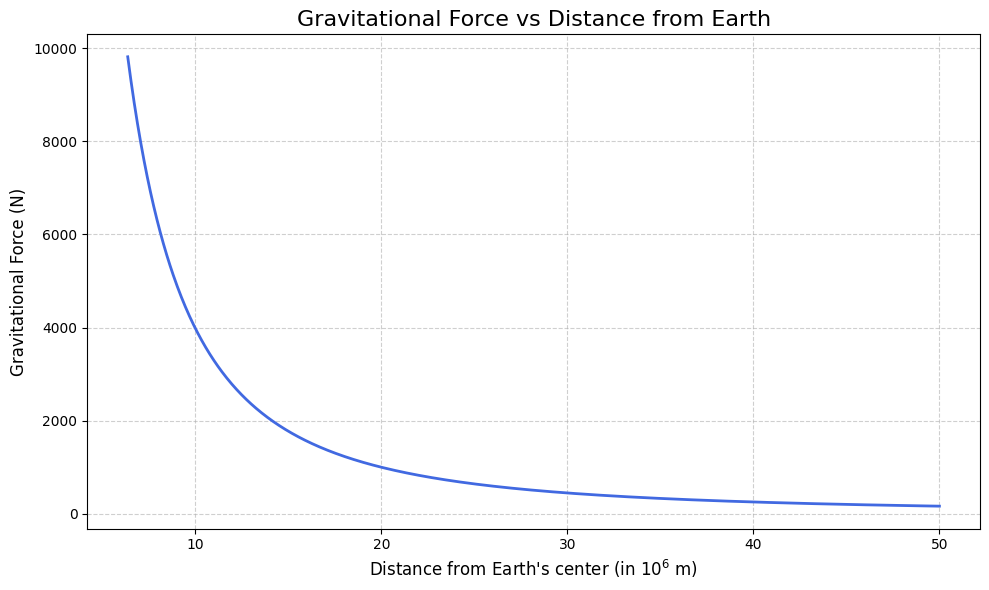
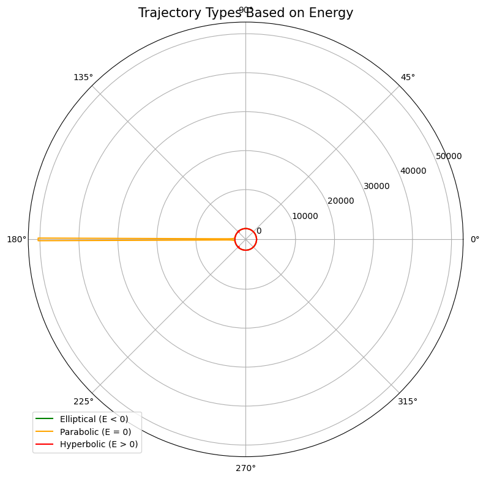
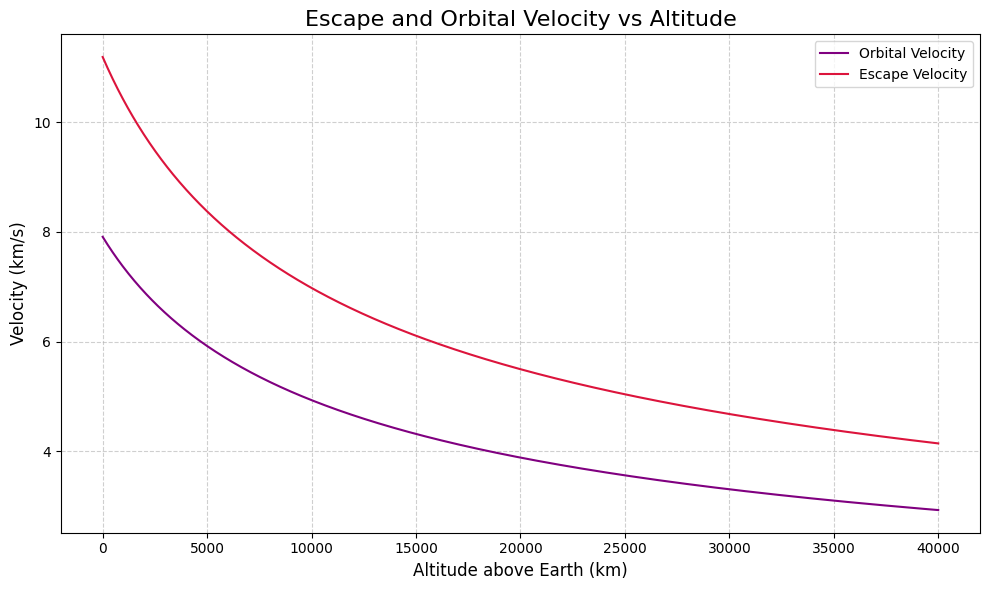
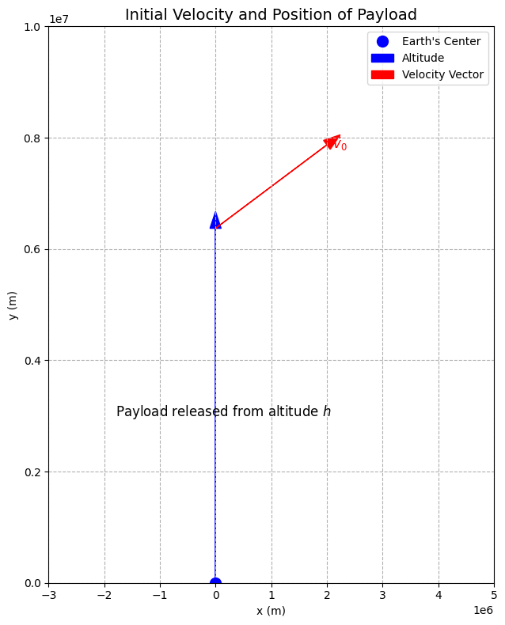
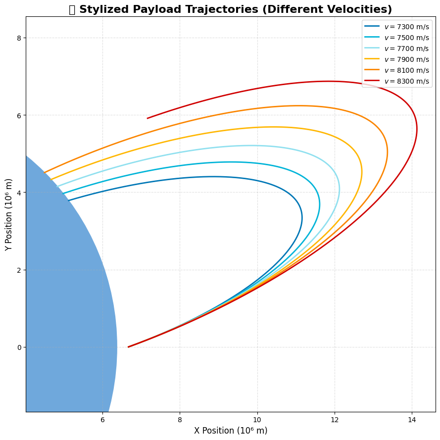
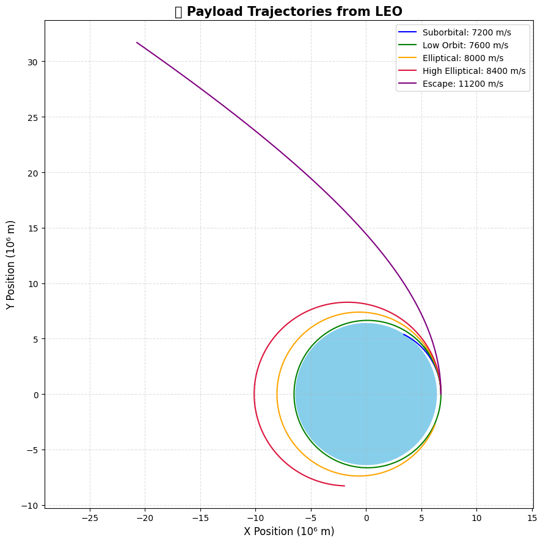

# Problem 3

# 🚀 Problem 3: Trajectories of a Freely Released Payload Near Earth

---

## 🔍 Understanding the Physics Concepts

### ⚖️ Newton’s Law of Universal Gravitation

- The gravitational force $F$ between two masses is given by:

$$
F = G\frac{m_1 m_2}{r^2}
$$

where:
- $G \approx 6.674 \times 10^{-11}~\text{N}\cdot\text{m}^2/\text{kg}^2$ is the gravitational constant  
- $m_1$ and $m_2$ are the masses  
- $r$ is the distance between the centers of the two masses

- For a small object (payload) near Earth:

$$
F = G\frac{M_{\oplus} m}{r^2}
$$

where $M_{\oplus}$ is Earth's mass, $m$ is the payload mass, and $r$ is the distance from Earth's center.

---

### 🌌 Types of Trajectories-Visual



---



---



---



---


The nature of the trajectory depends on the total mechanical energy $E$:

$$
E = \frac{1}{2}mv^2 - \frac{GM_{\oplus}m}{r}
$$

- **Elliptical Orbit**: $E < 0$  
- **Parabolic Escape Trajectory**: $E = 0$  
- **Hyperbolic Escape Trajectory**: $E > 0$

Velocity thresholds:
- **Orbital Velocity** (for circular orbit):

$$
v_{\text{orb}} = \sqrt{\frac{GM_{\oplus}}{r}}
$$

- **Escape Velocity**:

$$
v_{\text{esc}} = \sqrt{2} \cdot v_{\text{orb}} = \sqrt{\frac{2GM_{\oplus}}{r}}
$$

---

### 🪐 Kepler's Laws (for Elliptical Orbits)

1. **First Law (Elliptical Orbits)**:  
   - Planets move in ellipses with the Sun (or central mass) at one focus.

2. **Second Law (Equal Areas in Equal Times)**:  
   - A line joining a planet and the Sun sweeps out equal areas in equal intervals of time.

3. **Third Law (Harmonic Law)**:  
   - The square of the orbital period $T$ is proportional to the cube of the semi-major axis $a$:

$$
T^2 \propto a^3
$$

---

## 🧮 Defining the Problem Mathematically

### 🧭 Variables and Initial Conditions

Let the payload be released from a moving rocket at altitude $h$. Define:

- $r_0 = R_{\oplus} + h$: Initial radial distance from Earth's center  
- $\vec{v}_0$: Initial velocity vector of the payload  
- $\theta$: Angle between velocity and local horizontal  
- $m$: Mass of payload (may cancel out in equations)  
- $\vec{r}(t)$: Position vector as a function of time  
- $\vec{v}(t)$: Velocity vector as a function of time  

---

### 🧭 Equations of Motion under Gravity

Let the acceleration be determined only by gravity (neglecting drag and other forces). The equation of motion is:

$$
\frac{d^2 \vec{r}}{dt^2} = -\frac{GM_{\oplus}}{|\vec{r}|^3} \vec{r}
$$

- This is a second-order ordinary differential equation (ODE)  
- Can be solved numerically using methods like Runge-Kutta  

---

### 🧾 Summary of Key Constants

- $G = 6.674 \times 10^{-11}~\text{N}\cdot\text{m}^2/\text{kg}^2$  
- $M_{\oplus} = 5.972 \times 10^{24}~\text{kg}$  
- $R_{\oplus} = 6.371 \times 10^6~\text{m}$

---

# 🧮 Chapter 3: Numerical Simulation of Payload Trajectory


## 🧰 Choose a Numerical Method

To simulate the motion of a payload under Earth's gravity, we need to solve the **second-order differential equation**:

$$
\frac{d^2\vec{r}}{dt^2} = -\frac{GM_{\oplus}}{|\vec{r}|^3} \vec{r}
$$

This is equivalent to solving a **system of first-order ODEs** by introducing velocity as a separate state:

Let:

- $\vec{r}(t)$: position vector
- $\vec{v}(t) = \frac{d\vec{r}}{dt}$: velocity vector

Then:

$$
\frac{d\vec{r}}{dt} = \vec{v}, \quad \frac{d\vec{v}}{dt} = -\frac{GM_{\oplus}}{|\vec{r}|^3} \vec{r}
$$

### ✅ Method Selection

- **Euler’s Method**: Simple but inaccurate for orbital simulations.
- **Runge-Kutta 4th Order (RK4)**: Offers a good balance of **accuracy** and **efficiency**. Chosen for this simulation.

---

## ⏱️ Define Simulation Parameters

We need to define:

- Initial position $\vec{r}_0$ (depends on altitude $h$)
- Initial velocity $\vec{v}_0$ (depends on angle $\theta$)
- Gravitational constant $G$ and Earth's mass $M_{\oplus}$
- Time step $\Delta t$
- Total simulation time $T$

---

## 🐍 Implementing the Simulation in Python



---


### 🎯 Objective:

Simulate and visualize the trajectory of a payload released near Earth using RK4.

### ✅ Inputs:

- Initial position $\vec{r}_0$
- Initial velocity $\vec{v}_0$
- Release angle $\theta$
- Altitude $h$
- Time step $\Delta t$

### 📦 Output:

- Time-evolving position vectors $\vec{r}(t)$
- A 2D trajectory plot in space

```python
import numpy as np
import matplotlib.pyplot as plt

# Constants
G = 6.67430e-11  # Gravitational constant (m³/kg/s²)
M = 5.972e24     # Earth mass (kg)
R_earth = 6.371e6  # Earth radius (m)

# Simulation setup
altitude = 300e3                     # Initial altitude (m)
r0 = np.array([R_earth + altitude, 0])  # Initial position (m)
angles = [0]  # Straight launch
velocities = [7300, 7500, 7700, 7900, 8100, 8300]  # Different speeds (m/s)
dt = 1.5  # Time step (s)
T = 5500  # Total simulation time (s)
steps = int(T / dt)

# Define acceleration under gravity
def acceleration(pos):
    r = np.linalg.norm(pos)
    return -G * M * pos / r**3

# RK4 integrator
def rk4_orbit(r0, v0):
    r = np.zeros((steps, 2))
    v = np.zeros((steps, 2))
    r[0], v[0] = r0, v0
    for i in range(steps - 1):
        k1v = acceleration(r[i])
        k1r = v[i]

        k2v = acceleration(r[i] + 0.5 * dt * k1r)
        k2r = v[i] + 0.5 * dt * k1v

        k3v = acceleration(r[i] + 0.5 * dt * k2r)
        k3r = v[i] + 0.5 * dt * k2v

        k4v = acceleration(r[i] + dt * k3r)
        k4r = v[i] + dt * k3v

        r[i+1] = r[i] + dt/6 * (k1r + 2*k2r + 2*k3r + k4r)
        v[i+1] = v[i] + dt/6 * (k1v + 2*k2v + 2*k3v + k4v)
        
        if np.linalg.norm(r[i+1]) < R_earth:
            r = r[:i+2]  # Stop at impact
            break
    return r

# Plotting
plt.figure(figsize=(9, 9))
colors = ['#0077b6', '#00b4d8', '#90e0ef', '#ffb703', '#fb8500', '#d00000']
for v_mag, color in zip(velocities, colors):
    angle = np.radians(20)  # slight angle
    v0 = v_mag * np.array([np.cos(angle), np.sin(angle)])
    trajectory = rk4_orbit(r0, v0)
    plt.plot(trajectory[:, 0] / 1e6, trajectory[:, 1] / 1e6,
             label=f'$v = {v_mag}$ m/s', linewidth=2.0, color=color)

# Draw Earth
earth = plt.Circle((0, 0), R_earth / 1e6, color='#6fa8dc', zorder=0)
plt.gca().add_artist(earth)

# Style the plot
plt.title("🪐 Stylized Payload Trajectories (Different Velocities)", fontsize=16, weight='bold')
plt.xlabel("X Position (10⁶ m)", fontsize=12)
plt.ylabel("Y Position (10⁶ m)", fontsize=12)
plt.axis('equal')
plt.grid(True, linestyle='--', alpha=0.4)
plt.legend(loc='upper right', fontsize=10)
plt.tight_layout()
plt.show()
```

# 🚀 Visualizing and Analyzing Payload Trajectories

This section presents the **visual and analytical interpretation** of simulated trajectories for payloads released near Earth under the influence of gravity.

---

## 🎯 Objectives

- 📈 Plot and analyze 2D trajectories of payloads.
- 🌀 Classify orbits: **elliptical**, **hyperbolic**, and **suborbital**.
- 💡 Highlight critical velocities like **orbital** and **escape velocity**.
- 🧠 Draw practical conclusions for space missions (e.g., reentry, orbital insertion).

---

## 📊 Visualizing the Results

### ✳️ Key Quantities

- **Orbital velocity** at low Earth orbit:
 $$
v_{orbital} = \sqrt{\frac{GM}{R + h}}
$$
- **Escape velocity** from the same altitude:
$$
v_{escape} = \sqrt{\frac{2GM}{R + h}}
$$

Where:
- $G$ = gravitational constant,
- $M$ = mass of Earth,
- $R$ = radius of Earth,
- $h$ = altitude of payload.

---

### 📐 Trajectory Types

- **Bound orbits**: Elliptical paths where $E < 0$.
- **Escape trajectories**: Hyperbolic paths where $E > 0$.
- **Reentry/Suborbital**: Short arcs falling back to Earth.

---

### 🔧 Plotting in Python (2D Example)



---


```python
import numpy as np
import matplotlib.pyplot as plt

# Constants
G = 6.67430e-11
M = 5.972e24
R_earth = 6.371e6
altitude = 400e3
r0 = np.array([R_earth + altitude, 0])
dt = 1.5
T = 6000
steps = int(T / dt)

# Function: Gravitational acceleration
def gravity(pos):
    r = np.linalg.norm(pos)
    return -G * M * pos / r**3

# RK4 Integrator
def rk4(r0, v0):
    r = np.zeros((steps, 2))
    v = np.zeros((steps, 2))
    r[0], v[0] = r0, v0
    for i in range(steps - 1):
        k1v = gravity(r[i])
        k1r = v[i]
        k2v = gravity(r[i] + 0.5 * dt * k1r)
        k2r = v[i] + 0.5 * dt * k1v
        k3v = gravity(r[i] + 0.5 * dt * k2r)
        k3r = v[i] + 0.5 * dt * k2v
        k4v = gravity(r[i] + dt * k3r)
        k4r = v[i] + dt * k3v
        r[i+1] = r[i] + dt/6 * (k1r + 2*k2r + 2*k3r + k4r)
        v[i+1] = v[i] + dt/6 * (k1v + 2*k2v + 2*k3v + k4v)
        if np.linalg.norm(r[i+1]) < R_earth:
            return r[:i+2]
    return r

# Simulation
velocities = [7200, 7600, 8000, 8400, 11200]  # m/s
colors = ['blue', 'green', 'orange', 'crimson', 'purple']
labels = ['Suborbital', 'Low Orbit', 'Elliptical', 'High Elliptical', 'Escape']

plt.figure(figsize=(9, 9))
for v_mag, color, label in zip(velocities, colors, labels):
    v0 = v_mag * np.array([0, 1])
    path = rk4(r0, v0)
    plt.plot(path[:, 0]/1e6, path[:, 1]/1e6, label=f'{label}: {v_mag} m/s', color=color)

# Draw Earth
earth = plt.Circle((0, 0), R_earth / 1e6, color='skyblue', zorder=0)
plt.gca().add_artist(earth)

# Plot styling
plt.title("🔭 Payload Trajectories from LEO", fontsize=15, weight='bold')
plt.xlabel("X Position (10⁶ m)", fontsize=12)
plt.ylabel("Y Position (10⁶ m)", fontsize=12)
plt.axis('equal')
plt.grid(True, linestyle='--', alpha=0.4)
plt.legend()
plt.tight_layout()
plt.show()
```