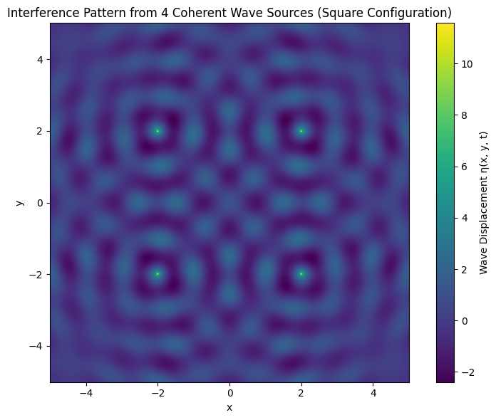
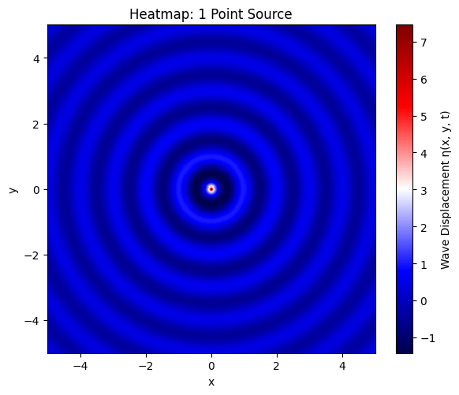
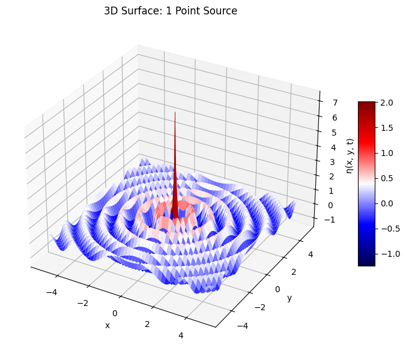
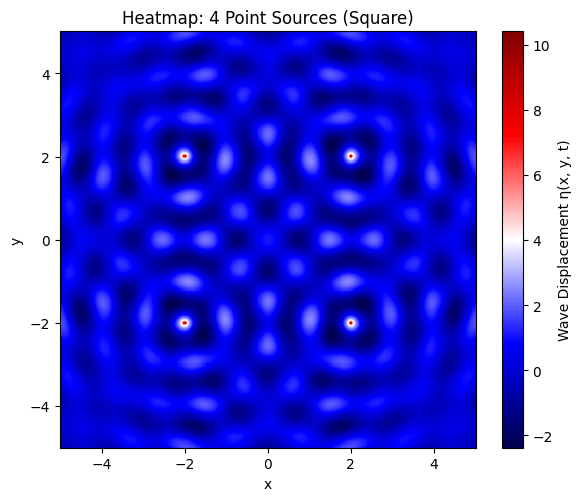
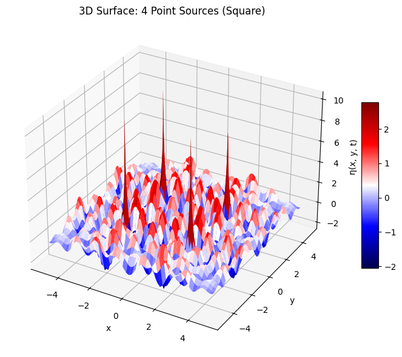
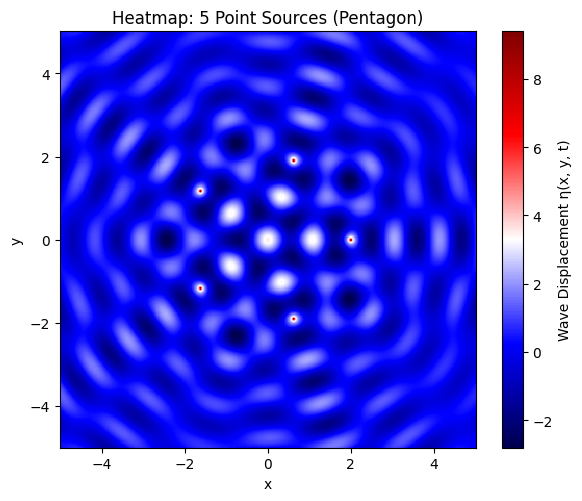
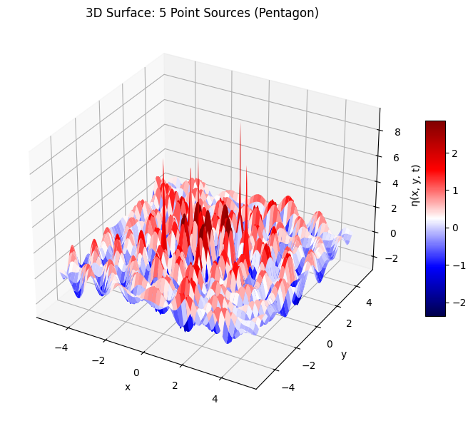

# Problem 1

# 🌊 Interference Patterns on a Water Surface – Wave Modeling

## 🔷 Step 1: Choosing a Regular Polygon

We begin by choosing a **regular polygon** as the geometric base for placing wave sources. In this case, we select a:

- **Square**: A 4-sided regular polygon.

Let the side length be normalized, and the center of the square be located at the origin $(0,0)$. Then, the vertices (wave sources) are placed symmetrically around the origin:

### 🔹 Vertex Coordinates (Wave Sources)

Let the distance from the center to each vertex be $R$. Then the coordinates are:

- $(x_1,y_1) = (R,R)$
- $(x_2,y_2) = (-R,R)$
- $(x_3,y_3) = (-R,-R)$
- $(x_4,y_4) = (R,-R)$

These correspond to the corners of a square centered at the origin.

---

## 📐 Step 2: Define Wave Parameters

We define the physical properties of each wave emitted from the sources:

- **Amplitude**: $A$
- **Wavelength**: $\lambda$
- **Frequency**: $f$
- **Angular Frequency**:  
$$
\omega = 2\pi f
$$
- **Wave Number**:  
$$
k = \frac{2\pi}{\lambda}
$$
- **Initial Phase**: $\phi$  
  (Assume same phase for all sources for coherence)

---

## 🧮 Step 3: Mathematical Model – Single Source



---

The displacement of the water surface at point $(x,y)$ and time $t$ from a single point source located at $(x_0,y_0)$ is given by:

$$
\eta(x,y,t) = \frac{A}{\sqrt{r}} \cdot \cos\left(kr - \omega t + \phi\right)
$$

where

- $r = \sqrt{(x - x_0)^2 + (y - y_0)^2}$ is the distance from the source to the point $(x,y)$,
- $A$ is the amplitude,
- $k$ is the wave number,
- $\omega$ is the angular frequency,
- $\phi$ is the initial phase.

---

## 📊 Step 4: Superposition from Multiple Sources


---

Since the waves from all sources are **coherent and identical** (same $A$, $k$, $f$, and $\phi$), the **total surface displacement** at any point $(x,y)$ and time $t$ is:

$$
\eta_{\text{sum}}(x,y,t) = \sum_{i=1}^{N} \eta_i(x,y,t)
$$

For a square, $N=4$, so:

$$
\eta_{\text{sum}}(x,y,t) = \sum_{i=1}^{4} \frac{A}{\sqrt{r_i}} \cdot \cos\left(k r_i - \omega t + \phi\right)
$$

where $r_i = \sqrt{(x - x_i)^2 + (y - y_i)^2}$ for each source $i$.

---

## Python codes

```python
# 📦 Import required libraries
import numpy as np
import matplotlib.pyplot as plt
from matplotlib.animation import FuncAnimation, PillowWriter
from IPython.display import Image

# 📐 Define wave and simulation parameters
A = 1.0             # Amplitude
wavelength = 1.0    # Wavelength λ
frequency = 1.0     # Frequency f
phi = 0             # Initial phase
omega = 2 * np.pi * frequency
k = 2 * np.pi / wavelength

# 🎯 Define source positions (Square centered at origin, side length 2R)
R = 2.0
sources = [
    ( R,  R),  # top-right
    (-R,  R),  # top-left
    (-R, -R),  # bottom-left
    ( R, -R),  # bottom-right
]

# 🗺️ Set up spatial grid
x = np.linspace(-5, 5, 300)
y = np.linspace(-5, 5, 300)
X, Y = np.meshgrid(x, y)

# 🎞️ Set up the figure
fig, ax = plt.subplots(figsize=(6, 5))
c = ax.pcolormesh(X, Y, np.zeros_like(X), shading='auto', cmap='viridis', vmin=-2, vmax=2)
fig.colorbar(c, ax=ax, label='Wave Displacement η(x, y, t)')
ax.set_title('Interference Pattern from 4 Coherent Wave Sources')
ax.set_xlabel('x')
ax.set_ylabel('y')
ax.set_aspect('equal')

# 🔁 Animation update function
def update(frame):
    t = frame * 0.1
    eta_total = np.zeros_like(X)
    for (x0, y0) in sources:
        r = np.sqrt((X - x0)**2 + (Y - y0)**2) + 1e-6
        eta = (A / np.sqrt(r)) * np.cos(k * r - omega * t + phi)
        eta_total += eta
    c.set_array(eta_total.ravel())
    return [c]

# ⚙️ Create animation
frames = 60
anim = FuncAnimation(fig, update, frames=frames, blit=True)

# 💾 Save the animation as GIF
gif_path = "wave_interference.gif"
anim.save(gif_path, writer=PillowWriter(fps=10))

# 🎬 Display the gif
from IPython.display import display
display(Image(filename=gif_path))
```
---

# 📚 Wave Interference Simulation – Superposition of Multiple Sources


## 🧭 Objective

We simulate the interference pattern generated by multiple coherent point wave sources using the principle of **wave superposition** on a 2D water surface.

---

## 🧮 Step-by-Step Mathematical Procedure

### 🔹 Step 1: Distance from Each Source to Grid Points

To compute the contribution of each wave source at each grid point $(x, y)$, we calculate the distance from the $i$-th source $(x_i, y_i)$:

$$
r_i = \sqrt{(x - x_i)^2 + (y - y_i)^2}
$$

This quantity determines the phase and amplitude attenuation for each wave at a given point.

---

### 🔹 Step 2: Superposition of Waves

For each point on the grid, the total displacement is given by the **principle of linear superposition**:

$$
\eta_{\text{sum}}(x, y, t) = \sum_{i=1}^{N} \eta_i(x, y, t)
$$

Each $\eta_i$ is the displacement from the $i$-th point source:

$$
\eta_i(x, y, t) = \frac{A}{\sqrt{r_i}} \cdot \cos(kr_i - \omega t + \phi)
$$

Where:
- $A$ is the amplitude of the wave,
- $r_i$ is the distance to the $i$-th source,
- $k = \frac{2\pi}{\lambda}$ is the wave number,
- $\omega = 2\pi f$ is the angular frequency,
- $\phi$ is the initial phase.

---

## 🧪 Simulation Implementation 



---



---



---



---



---



---

```python
# 📦 Import libraries
import numpy as np
import matplotlib.pyplot as plt
from mpl_toolkits.mplot3d import Axes3D

# 📐 Wave parameters
A = 1.0                # Amplitude
wavelength = 1.0       # Wavelength λ
frequency = 1.0        # Frequency f
phi = 0                # Initial phase φ
omega = 2 * np.pi * frequency
k = 2 * np.pi / wavelength

# 🗺️ Spatial grid
L = 5                      # Domain size
res = 400                  # Resolution
x = np.linspace(-L, L, res)
y = np.linspace(-L, L, res)
X, Y = np.meshgrid(x, y)
t = 0.0                    # Time snapshot

# 🧮 Helper function to compute total wave displacement
def compute_eta(sources):
    eta_total = np.zeros_like(X)
    for (x0, y0) in sources:
        r = np.sqrt((X - x0)**2 + (Y - y0)**2) + 1e-6
        eta = (A / np.sqrt(r)) * np.cos(k * r - omega * t + phi)
        eta_total += eta
    return eta_total

# 📍 Define source configurations
R = 2.0  # Radius for source placement

# 1 Source (centered)
sources_1 = [(0, 0)]

# 4 Sources (square vertices)
sources_4 = [
    ( R,  R),
    (-R,  R),
    (-R, -R),
    ( R, -R)
]

# 5 Sources (regular pentagon)
sources_5 = [(R * np.cos(2*np.pi*i/5), R * np.sin(2*np.pi*i/5)) for i in range(5)]

# 📊 Generate all displacements
eta_1 = compute_eta(sources_1)
eta_4 = compute_eta(sources_4)
eta_5 = compute_eta(sources_5)

# 🎨 2D Heatmap Plot Function
def plot_heatmap(eta, title):
    plt.figure(figsize=(6, 5))
    plt.pcolormesh(X, Y, eta, shading='auto', cmap='seismic')
    plt.colorbar(label='Wave Displacement η(x, y, t)')
    plt.title(title)
    plt.xlabel('x')
    plt.ylabel('y')
    plt.gca().set_aspect('equal')
    plt.tight_layout()
    plt.show()

# 🏔️ 3D Surface Plot Function
def plot_surface(eta, title):
    fig = plt.figure(figsize=(8, 6))
    ax = fig.add_subplot(111, projection='3d')
    surf = ax.plot_surface(X, Y, eta, cmap='seismic', linewidth=0, antialiased=True)
    ax.set_title(title)
    ax.set_xlabel('x')
    ax.set_ylabel('y')
    ax.set_zlabel('η(x, y, t)')
    fig.colorbar(surf, shrink=0.5, aspect=10)
    plt.tight_layout()
    plt.show()

# 📌 Plot all 2D heatmaps
plot_heatmap(eta_1, "Heatmap: 1 Point Source")
plot_heatmap(eta_4, "Heatmap: 4 Point Sources (Square)")
plot_heatmap(eta_5, "Heatmap: 5 Point Sources (Pentagon)")

# 📌 Plot all 3D surface plots
plot_surface(eta_1, "3D Surface: 1 Point Source")
plot_surface(eta_4, "3D Surface: 4 Point Sources (Square)")
plot_surface(eta_5, "3D Surface: 5 Point Sources (Pentagon)")
```