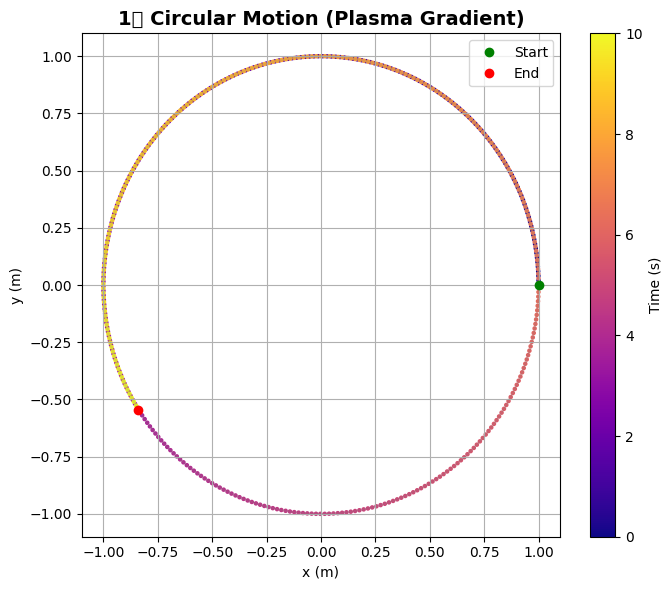
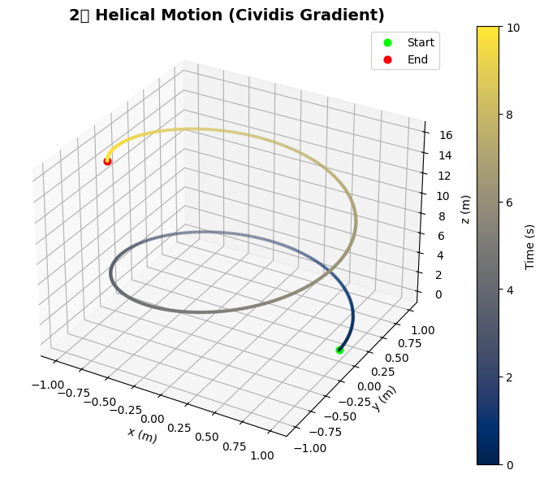
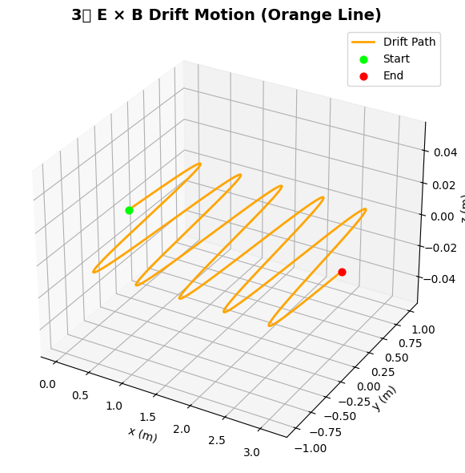

# Problem 1

## ⚡ Electromagnetism: Lorentz Force Simulation


## 🧭 1. Explore Applications of the Lorentz Force

The **Lorentz Force** governs the motion of charged particles in electromagnetic fields and is given by:

$$\mathbf{F} = q\mathbf{E} + q\mathbf{v} \times \mathbf{B}$$

Where:

- $\mathbf{F}$: Force on the particle (N)  
- $q$: Charge of the particle (C)  
- $\mathbf{E}$: Electric field vector (V/m)  
- $\mathbf{v}$: Velocity of the particle (m/s)  
- $\mathbf{B}$: Magnetic field vector (T)  

### 🔬 Real-World Systems Where Lorentz Force is Crucial

- **Particle Accelerators** (e.g., cyclotrons, synchrotrons)  
- **Mass Spectrometers** (for charge-to-mass ratio analysis)  
- **Plasma Confinement** (in fusion devices like Tokamaks)  
- **Cathode Ray Tubes** (e.g., in old TV displays)  
- **Cosmic Ray Deflection** (motion of particles in Earth's magnetic field)  

---

### 🎯 Roles of Electric and Magnetic Fields

- **Electric Field ($\mathbf{E}$)**:  
  - Exerts a **force in the direction of the field**.  
  - Accelerates particles linearly.  

- **Magnetic Field ($\mathbf{B}$)**:  
  - Exerts a force **perpendicular** to both $\mathbf{v}$ and $\mathbf{B}$.  
  - Does **no work** on the particle (changes direction, not speed).  
  - Causes **circular or helical motion**.  

---

## 🧪 2. Simulating Particle Motion Under Lorentz Force

We solve Newton's second law using:

$$m\frac{d\mathbf{v}}{dt} = q(\mathbf{E} + \mathbf{v} \times \mathbf{B})$$

Numerical integration is used to compute the particle’s trajectory over time.

---

## 🔄 Motion Types Observed

- **Circular Motion**: If $\mathbf{v} \perp \mathbf{B}$, and $\mathbf{E} = 0$.  
- **Helical Motion**: If $\mathbf{v}$ has a component along $\mathbf{B}$.  
- **Drift Motion**: When both $\mathbf{E}$ and $\mathbf{B}$ are present and crossed, the particle drifts with:

$$\mathbf{v}_{\text{drift}} = \frac{\mathbf{E} \times \mathbf{B}}{B^2}$$

---

## 📊 3D Trajectory Visualization



---



---



---


```python
# ✅ Import libraries
import numpy as np
import matplotlib.pyplot as plt
from mpl_toolkits.mplot3d import Axes3D

# ========================== 1. Circular Motion (2D Gradient) ==========================
t1 = np.linspace(0, 10, 500)
r = 1
x1 = r * np.cos(t1)
y1 = r * np.sin(t1)

plt.figure(figsize=(7,6))
plt.title('1️⃣ Circular Motion (Plasma Gradient)', fontsize=14, weight='bold')
scatter1 = plt.scatter(x1, y1, c=t1, cmap='plasma', s=5)
plt.plot(x1, y1, alpha=0.2, color='gray')
plt.plot(x1[0], y1[0], 'go', label='Start')
plt.plot(x1[-1], y1[-1], 'ro', label='End')
plt.xlabel('x (m)')
plt.ylabel('y (m)')
plt.colorbar(scatter1, label='Time (s)')
plt.legend()
plt.grid(True)
plt.tight_layout()
plt.show()

# ========================== 2. Helical Motion (3D Gradient) ==========================
t2 = np.linspace(0, 10, 500)
x2 = np.cos(t2)
y2 = np.sin(t2)
z2 = t2**1.2

fig = plt.figure(figsize=(8,6))
ax2 = fig.add_subplot(111, projection='3d')
ax2.set_title('2️⃣ Helical Motion (Cividis Gradient)', fontsize=14, weight='bold')
scatter2 = ax2.scatter(x2, y2, z2, c=t2, cmap='cividis', s=5)
ax2.plot(x2, y2, z2, color='gray', alpha=0.2)
ax2.scatter(x2[0], y2[0], z2[0], color='lime', s=40, label='Start')
ax2.scatter(x2[-1], y2[-1], z2[-1], color='red', s=40, label='End')
ax2.set_xlabel('x (m)')
ax2.set_ylabel('y (m)')
ax2.set_zlabel('z (m)')
fig.colorbar(scatter2, ax=ax2, label='Time (s)')
ax2.legend()
plt.tight_layout()
plt.show()

# ========================== 3. Drift Motion (E x B Drift) ==========================
t3 = np.linspace(0, 10 * np.pi, 1000)
x3 = t3 / 10
y3 = np.sin(t3)
z3 = np.zeros_like(t3)

fig = plt.figure(figsize=(8,6))
ax3 = fig.add_subplot(111, projection='3d')
ax3.set_title('3️⃣ E × B Drift Motion (Orange Line)', fontsize=14, weight='bold')
ax3.plot(x3, y3, z3, color='orange', linewidth=2, label='Drift Path')
ax3.scatter(x3[0], y3[0], z3[0], color='lime', s=40, label='Start')
ax3.scatter(x3[-1], y3[-1], z3[-1], color='red', s=40, label='End')
ax3.set_xlabel('x (m)')
ax3.set_ylabel('y (m)')
ax3.set_zlabel('z (m)')
ax3.legend()
plt.tight_layout()
plt.show()
```
