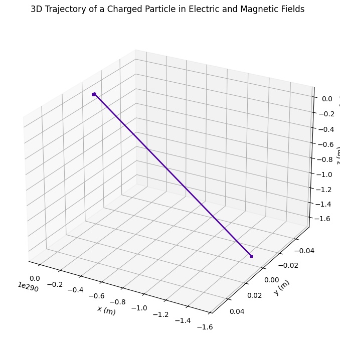

# Problem 1

## ⚡ Electromagnetism: Lorentz Force Simulation


## 🧭 1. Explore Applications of the Lorentz Force

The **Lorentz Force** governs the motion of charged particles in electromagnetic fields and is given by:

$$\mathbf{F} = q\mathbf{E} + q\mathbf{v} \times \mathbf{B}$$

Where:

- $\mathbf{F}$: Force on the particle (N)  
- $q$: Charge of the particle (C)  
- $\mathbf{E}$: Electric field vector (V/m)  
- $\mathbf{v}$: Velocity of the particle (m/s)  
- $\mathbf{B}$: Magnetic field vector (T)  

### 🔬 Real-World Systems Where Lorentz Force is Crucial

- **Particle Accelerators** (e.g., cyclotrons, synchrotrons)  
- **Mass Spectrometers** (for charge-to-mass ratio analysis)  
- **Plasma Confinement** (in fusion devices like Tokamaks)  
- **Cathode Ray Tubes** (e.g., in old TV displays)  
- **Cosmic Ray Deflection** (motion of particles in Earth's magnetic field)  

---

### 🎯 Roles of Electric and Magnetic Fields

- **Electric Field ($\mathbf{E}$)**:  
  - Exerts a **force in the direction of the field**.  
  - Accelerates particles linearly.  

- **Magnetic Field ($\mathbf{B}$)**:  
  - Exerts a force **perpendicular** to both $\mathbf{v}$ and $\mathbf{B}$.  
  - Does **no work** on the particle (changes direction, not speed).  
  - Causes **circular or helical motion**.  

---

## 🧪 2. Simulating Particle Motion Under Lorentz Force

We solve Newton's second law using:

$$m\frac{d\mathbf{v}}{dt} = q(\mathbf{E} + \mathbf{v} \times \mathbf{B})$$

Numerical integration is used to compute the particle’s trajectory over time.

---

## 🔄 Motion Types Observed

- **Circular Motion**: If $\mathbf{v} \perp \mathbf{B}$, and $\mathbf{E} = 0$.  
- **Helical Motion**: If $\mathbf{v}$ has a component along $\mathbf{B}$.  
- **Drift Motion**: When both $\mathbf{E}$ and $\mathbf{B}$ are present and crossed, the particle drifts with:

$$\mathbf{v}_{\text{drift}} = \frac{\mathbf{E} \times \mathbf{B}}{B^2}$$

---

## 📊 3D Trajectory Visualization



---

```python
import numpy as np
import matplotlib.pyplot as plt
from mpl_toolkits.mplot3d import Axes3D

# Physical constants
q = 1.6e-19  # charge (Coulombs)
m = 9.11e-31  # mass (kg) - electron mass

# Fields
E = np.array([0, 0, 1e5])  # electric field (V/m) along z
B = np.array([0, 1, 0])    # magnetic field (T) along y

# Initial conditions
r0 = np.array([0, 0, 0])    # initial position (m)
v0 = np.array([1e5, 0, 0])  # initial velocity (m/s)

# Time parameters
dt = 1e-9
N = 1000
t = np.linspace(0, N*dt, N)

# Arrays to store position and velocity
r = np.zeros((N, 3))
v = np.zeros((N, 3))
r[0] = r0
v[0] = v0

# Lorentz force update loop
for i in range(N - 1):
    F = q * (E + np.cross(v[i], B))
    a = F / m
    v[i + 1] = v[i] + a * dt
    r[i + 1] = r[i] + v[i + 1] * dt

# Plotting with color gradient and visible dots
fig = plt.figure(figsize=(10, 7))
ax = fig.add_subplot(111, projection='3d')

# Color gradient along trajectory
colors = plt.cm.plasma(np.linspace(0, 1, N))

# Plot each segment with corresponding color and dot
for i in range(N - 1):
    ax.plot(r[i:i+2, 0], r[i:i+2, 1], r[i:i+2, 2], color=colors[i], lw=2)
    ax.scatter(r[i, 0], r[i, 1], r[i, 2], color=colors[i], s=15)

# Label axes and title
ax.set_xlabel('x (m)')
ax.set_ylabel('y (m)')
ax.set_zlabel('z (m)')
ax.set_title('3D Trajectory of a Charged Particle in Electric and Magnetic Fields')

# Set grid and view angle for better 3D perception
ax.grid(True)
ax.view_init(elev=25, azim=120)

plt.tight_layout()
plt.show()
```
