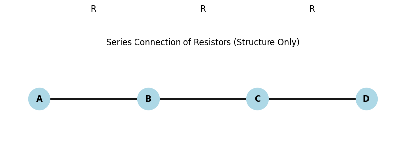
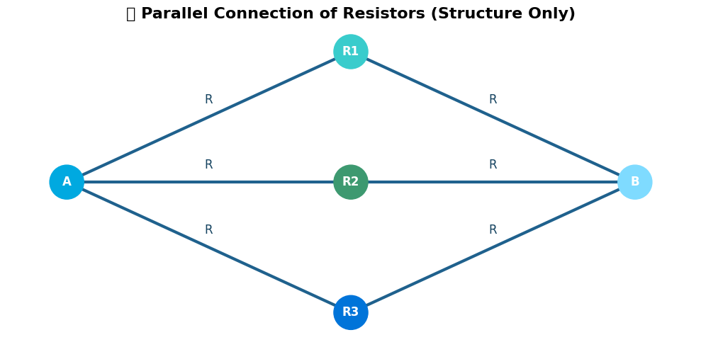

# Problem 1

# 📘 Equivalent Resistance Using Graph Theory


## 🧠 General Understanding (Applies to Both Options)

To analyze and simplify circuits using **graph theory**, we first need to understand how to **model an electrical circuit as a graph** and how classical rules like **series and parallel combinations** map onto this model.

---

### 🔌 Circuit as a Graph

A circuit can be represented as a **weighted undirected graph**:

- **Nodes (Vertices)**: Represent **electrical junctions** or connection points.
- **Edges**: Represent **resistors**, where the **edge weight** equals the resistance value $R$ in ohms $(\Omega)$.

#### 🔹 Example Mapping:

| Circuit Element | Graph Element       | Notes                                  |
|------------------|---------------------|----------------------------------------|
| Junction         | Node $v_i$          | No resistance associated               |
| Resistor $R$     | Edge $e_{ij}$       | Connects nodes $v_i \leftrightarrow v_j$, with weight $R$ |

---

### 🔁 Series and Parallel in Graph Terms

#### 🔸 Series Connection:



---

- Two resistors $R_1$ and $R_2$ are in **series** if:
  - They are connected end-to-end.
  - There is **no branching** at the middle junction.
  - In graph terms: a **node with degree 2** where both edges are resistors.

**Equivalent Resistance**:

$$
R_{eq} = R_1 + R_2
$$

#### 🔸 Parallel Connection:



---

- Two resistors $R_1$ and $R_2$ are in **parallel** if:
  - Both ends of the resistors are connected to the **same pair of nodes**.
  - In graph terms: **multiple edges** between the same two nodes.

**Equivalent Resistance**:

$$
\frac{1}{R_{eq}} = \frac{1}{R_1} + \frac{1}{R_2}
\quad \Rightarrow \quad
R_{eq} = \left( \frac{1}{R_1} + \frac{1}{R_2} \right)^{-1}
$$

---

### 🧩 Identifying Nested Series-Parallel Combinations

Nested combinations occur when series and parallel blocks are **combined hierarchically**, for example:

- A parallel block of resistors, each of which is itself a series of two resistors.
- A series of blocks, where each block is a parallel structure.

#### 🔍 Strategy to Simplify:

1. **Recursively identify** and reduce:
   - Lowest-level series groups.
   - Lowest-level parallel groups.
2. **Replace** each group with a single equivalent resistance.
3. Repeat until the entire circuit is reduced to a single equivalent resistor between the source and destination.

#### 🛠 Tools for Detection:

- **Node Degree**:
  - Degree-2 nodes likely indicate series connections.
  - Multiple edges between nodes indicate parallel paths.

- **Graph Traversal**:
  - DFS/BFS can help trace paths and identify reducible structures.

---

### 🧠 Summary

| Concept                  | Graph Term                  | Simplification Rule                              |
|--------------------------|-----------------------------|---------------------------------------------------|
| Junction                 | Node                        | No resistance, used for connection                |
| Resistor                 | Edge with weight $R$        | Carries resistance between two nodes              |
| Series connection        | Path through degree-2 node  | $R_{eq} = R_1 + R_2 + \dots$                      |
| Parallel connection      | Multi-edges between nodes   | $\frac{1}{R_{eq}} = \sum \frac{1}{R_i}$           |
| Nested configurations    | Subgraphs                   | Reduce inner groups first recursively             |

---

# 📘 Option 1: Simplified Task – Algorithm Description

---

## 🧠 Conceptual Overview

To compute the **equivalent resistance** between two nodes in a circuit using **graph theory**, the goal is to reduce the graph by successively collapsing:

- **Series connections** into single equivalent resistors
- **Parallel connections** into a single equivalent resistor
- **Nested structures** recursively

The final output should be a single resistor representing the **total resistance** between the two terminals.

---

## 🔍 Key Concepts

### 🔸 Graph Representation

- Each **junction** is a **node** $v_i$
- Each **resistor** is an **edge** $e_{ij}$ with weight $R_{ij}$
- The full circuit is a graph $G = (V, E)$ with:
- $V$: set of nodes
- $E$: set of edges with resistance weights

---

### 🔸 Series Connection Detection

**Condition**: A node $v_k$ has exactly **two neighbors** $v_i$ and $v_j$, and:

- There is no other connection or branching at $v_k$
- Resistors $R_1$ and $R_2$ are connected as $v_i - R_1 - v_k - R_2 - v_j$

**Combine** into:

$$
R_{eq} = R_1 + R_2
$$

### 🔸 Parallel Connection Detection

**Condition**: Multiple edges between the same pair of nodes $(v_i, v_j)$:

- $e_{ij}^{(1)}, e_{ij}^{(2)}, \dots, e_{ij}^{(n)}$

**Combine** using:

$$
\frac{1}{R_{eq}} = \sum_{k=1}^{n} \frac{1}{R_k}
$$

---

## 🧩 Handling Nested Configurations

Nested configurations are simplified by **recursively** applying the same logic:

- **Innermost groups** are simplified first.
- As reductions occur, new series or parallel patterns may emerge.
- These are detected again in the next iteration.

**Example**:  
A resistor network like `((R1 + R2) || (R3 + R4)) + R5` is handled by:

1. Reducing $R_1 + R_2$
2. Reducing $R_3 + R_4$
3. Applying parallel reduction
4. Adding $R_5$

---

## 🔀 Cycles and Branching

**Cycles** complicate the detection of series/parallel patterns.

- Basic series/parallel rules apply only to **acyclic subgraphs**
- For graphs with cycles:
  - Use **graph traversal algorithms** (DFS, BFS) to identify **simplifiable substructures**
  - Apply **loop transformation rules** like:
    - **Delta-Wye (Δ-Y) Transformations**
    - **Kirchhoff’s laws** in advanced versions

For now, this simplified algorithm **does not handle arbitrary cycles**; it's best suited for **series-parallel graphs**.

---

## 📌 Summary

| Feature                  | Handled in Algorithm | Method                                |
|--------------------------|----------------------|----------------------------------------|
| Series connections       | ✅ Yes               | Node degree = 2, combine resistors     |
| Parallel connections     | ✅ Yes               | Multiple edges between two nodes       |
| Nested combinations      | ✅ Yes               | Recursive simplification               |
| Cycles                   | ❌ Basic only         | Requires advanced methods              |

---

```python
# 📈 Series Connection Visualization (Structure Only)
import matplotlib.pyplot as plt
import networkx as nx

# Create a simple graph
G = nx.Graph()

# Define nodes
nodes = ["A", "B", "C", "D"]  # 3 resistors: A-B, B-C, C-D
G.add_nodes_from(nodes)

# Define edges as series resistors
edges = [("A", "B"), ("B", "C"), ("C", "D")]
G.add_edges_from(edges)

# Position nodes in a line (series layout)
pos = {
    "A": (0, 0),
    "B": (1, 0),
    "C": (2, 0),
    "D": (3, 0)
}

# Draw the graph
plt.figure(figsize=(8, 2))
nx.draw(G, pos, with_labels=True, node_color="lightblue", node_size=1000, font_weight="bold")
nx.draw_networkx_edges(G, pos, width=2)

# Annotate edges with 'R' to indicate resistor (without values)
for (u, v) in G.edges():
    x = (pos[u][0] + pos[v][0]) / 2
    y = (pos[u][1] + pos[v][1]) / 2 + 0.1
    plt.text(x, y, "R", fontsize=12, ha="center", va="center")

plt.title("Series Connection of Resistors (Structure Only)")
plt.axis("off")
plt.show()
```
```python
# 🎨 Parallel Connection Visualization with Styled Colors
import matplotlib.pyplot as plt
import networkx as nx

# Create graph
G = nx.Graph()

# Define nodes
nodes = ["A", "B", "R1", "R2", "R3"]
G.add_nodes_from(nodes)

# Add edges for 3 parallel paths from A to B
G.add_edges_from([
    ("A", "R1"), ("R1", "B"),
    ("A", "R2"), ("R2", "B"),
    ("A", "R3"), ("R3", "B")
])

# Define layout positions
pos = {
    "A": (0, 0),
    "R1": (1.5, 1.5),
    "R2": (1.5, 0),
    "R3": (1.5, -1.5),
    "B": (3, 0)
}

# Create figure
plt.figure(figsize=(10, 5))
plt.title("🌐 Parallel Connection of Resistors (Structure Only)", fontsize=16, fontweight='bold')

# Draw nodes with cool colors
node_colors = ["#00A9E0", "#7FDBFF", "#39CCCC", "#3D9970", "#0074D9"]
nx.draw_networkx_nodes(G, pos, node_color=node_colors, node_size=1200)

# Draw edges with uniform color and thickness
nx.draw_networkx_edges(G, pos, edge_color="#1F618D", width=3)

# Draw labels
nx.draw_networkx_labels(G, pos, font_size=12, font_weight="bold", font_color="white")

# Annotate resistor edges with 'R'
for r_node in ["R1", "R2", "R3"]:
    # Left side label
    x1 = (pos["A"][0] + pos[r_node][0]) / 2
    y1 = (pos["A"][1] + pos[r_node][1]) / 2
    plt.text(x1, y1 + 0.2, "R", fontsize=12, color="#154360", ha="center", va="center")

    # Right side label
    x2 = (pos["B"][0] + pos[r_node][0]) / 2
    y2 = (pos["B"][1] + pos[r_node][1]) / 2
    plt.text(x2, y2 + 0.2, "R", fontsize=12, color="#154360", ha="center", va="center")

# Clean display
plt.axis("off")
plt.tight_layout()
plt.show()
```