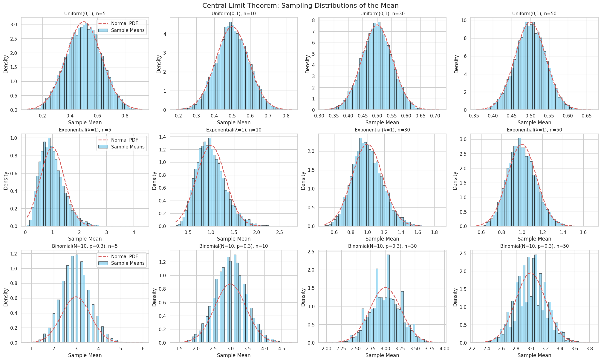
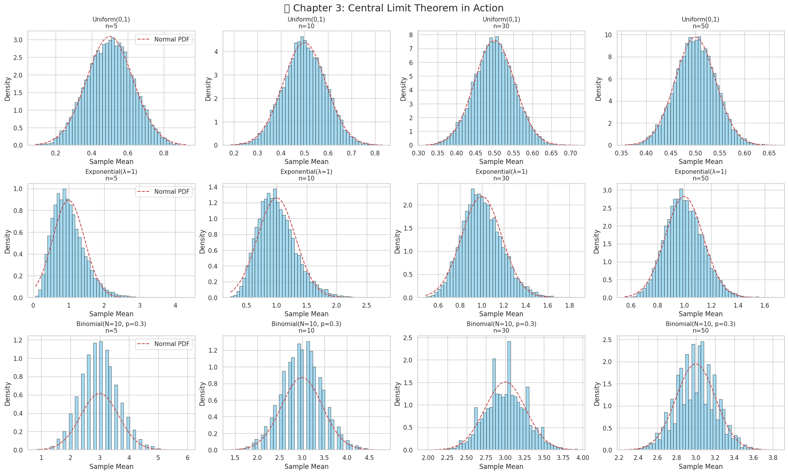
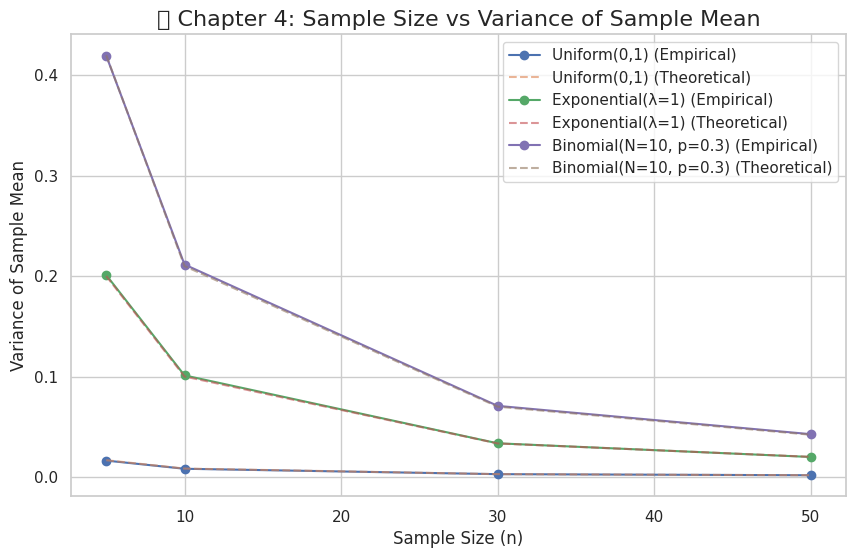

q# Problem 1

# Exploring the Central Limit Theorem through Simulation

> **Project objective:** Build intuitive understanding of the Central Limit Theorem (CLT) by simulating sampling distributions of the sample mean for several population distributions.

---

## 1  Mathematical Background  

- **Population mean**:  
$$\mu=\mathbb{E}[X]$$
- **Sample mean** (for a sample of size $n$):  
$$\bar{X}_n=\frac{1}{n}\sum_{i=1}^{n}X_i$$
- **Central Limit Theorem (one-dimensional form)**:  
$$\boxed{\sqrt{n}\,\frac{\bar{X}_n-\mu}{\sigma}\;\xrightarrow{\;d\;}\;\mathcal{N}(0,1)}$$  
where $\sigma^2=\operatorname{Var}(X)$ and $\xrightarrow{\;d\;}$ denotes convergence in distribution.

> *Regardless of the parent distribution*, the standardized sample mean approaches the standard normal distribution as $n\to\infty$.

---

## 2  Project Road-Map

1. **Set up population distributions**  
   • Uniform($a,b$)  
   • Exponential($\lambda$)  
   • Binomial($N,p$)  
   Generate a large synthetic *population* for each.  
2. **Sampling & sample-mean computation**  
   • Pick sample sizes $n\in\{5,10,30,50\}$.  
   • For each distribution & $n$:  
     – Draw $M$ independent samples (e.g. $M=10,000$).  
     – Compute $\bar{X}_n$ for every draw.  
     – Store the vector of means → *sampling distribution*.  
3. **(Next) Visualisation & diagnostics** *(placeholder)*  
   • Histograms & KDEs of sampling distributions.  
   • Normal Q–Q plots & Shapiro–Wilk tests.

---

## 3  Python Implementation  



```python
# 📦 Imports
import numpy as np
import pandas as pd
import matplotlib.pyplot as plt
import seaborn as sns
from scipy.stats import norm

# 🎲 Reproducibility
rng = np.random.default_rng(seed=42)

# 🔧 Simulation parameters
POP_SIZE = 1_000_000
M = 10_000
SAMPLE_SIZES = [5, 10, 30, 50]

# 📊 Create populations
a, b = 0, 1
pop_uniform = rng.uniform(a, b, POP_SIZE)

lambd = 1.0
pop_expon = rng.exponential(1 / lambd, POP_SIZE)

N, p = 10, 0.3
pop_binom = rng.binomial(N, p, POP_SIZE)

populations = {
    'Uniform(0,1)': pop_uniform,
    'Exponential(λ=1)': pop_expon,
    'Binomial(N=10, p=0.3)': pop_binom,
}

# 🧮 Helper to draw sample means
def sample_means(pop, n, m=M):
    idx = rng.integers(0, len(pop), size=m * n)
    samples = pop[idx].reshape(m, n)
    return samples.mean(axis=1)

# 📦 Generate sampling distributions
sampling_distributions = {}
for name, pop in populations.items():
    sampling_distributions[name] = {}
    for n in SAMPLE_SIZES:
        sampling_distributions[name][n] = sample_means(pop, n)

# 📊 Plotting function
def plot_sampling_distributions(sampling_distributions, populations):
    sns.set(style='whitegrid', palette='muted')
    fig, axs = plt.subplots(
        nrows=3, ncols=4, figsize=(20, 12), constrained_layout=True
    )

    for row_idx, (dist_name, n_dict) in enumerate(sampling_distributions.items()):
        pop_data = populations[dist_name]
        mu = np.mean(pop_data)
        sigma = np.std(pop_data)

        for col_idx, n in enumerate(SAMPLE_SIZES):
            ax = axs[row_idx, col_idx]
            sample_means = n_dict[n]

            sns.histplot(sample_means, bins=50, stat='density', kde=False, ax=ax, color='skyblue', edgecolor='black', label='Sample Means')

            # Overlay Normal distribution
            x = np.linspace(sample_means.min(), sample_means.max(), 200)
            pdf = norm.pdf(x, loc=mu, scale=sigma / np.sqrt(n))
            ax.plot(x, pdf, 'r--', lw=2, label='Normal PDF')

            ax.set_title(f'{dist_name}, n={n}', fontsize=11)
            ax.set_xlabel('Sample Mean')
            ax.set_ylabel('Density')

            if col_idx == 0:
                ax.legend()

    fig.suptitle('Central Limit Theorem: Sampling Distributions of the Mean', fontsize=16)
    plt.show()

# 🔍 Display visualisation
plot_sampling_distributions(sampling_distributions, populations)
```
---

## 4  Next Steps

- **Visualise** each `means` array with histograms & overlay a normal PDF.  
- **Standardise** the sample means:  
$$Z=\sqrt{n}\,\frac{\bar{X}_n-\mu}{\sigma}$$  
Plot their distribution and compare to $\mathcal{N}(0,1)$.  
- **Formal tests**: Kolmogorov–Smirnov or Anderson–Darling goodness-of-fit.

Feel free to extend or refactor the code – this notebook is meant as a clean, well-commented starting point.

---

> **Citation reminder:** If you use these materials in an academic context, please credit the author(s) appropriately.


# 📊 Visualizing and Understanding the Central Limit Theorem (CLT)

## 🎯 Objective

Explore how sampling distributions evolve as sample size increases, and reflect on the broader importance of the Central Limit Theorem (CLT) in statistics and real-world applications.

---

## 🔍 4. Visualize Sampling Distributions



---



---


### 📌 Goal:

To observe how sample means behave when drawn from different population distributions with varying sample sizes.

### 📈 Approach:

- For each population distribution:
  - Uniform(0, 1)
  - Exponential(λ = 1)
  - Binomial(N = 10, p = 0.3)

- For each sample size $n \in \{5, 10, 30, 50\}$:
  - Draw $M = 10{,}000$ random samples
  - Compute the sample mean $\bar{X}_n$
  - Plot a histogram of the resulting sample means

### 🧠 Observation Focus:

- Does the shape of the sampling distribution look approximately normal?
- How does the shape change as $n$ increases?

### 📐 Theoretical Foundation:

Let $X_1, X_2, \dots, X_n$ be i.i.d. random variables from a population with:
- Mean $\mu$
- Variance $\sigma^2$

Then the **sample mean** is:

$$
\bar{X}_n = \frac{1}{n} \sum_{i=1}^n X_i
$$

According to the **Central Limit Theorem**:

$$
\sqrt{n} \cdot \frac{\bar{X}_n - \mu}{\sigma} \xrightarrow{d} \mathcal{N}(0, 1)
$$

As $n \to \infty$, the sampling distribution of $\bar{X}_n$ approaches a normal distribution $\mathcal{N}(\mu, \sigma^2/n)$.

---

## 🔬 5. Analyze and Explore Parameters

### ❓ Questions to Investigate:

- How quickly do the sampling distributions become approximately normal for each population?
- How does **sample size** influence the **spread** and **shape** of the distribution?
- What is the role of **population variance** $\sigma^2$ on the width of the sampling distribution?

### 📏 Key Relationships:

- **Spread of the sampling distribution**:

$$
\operatorname{Var}(\bar{X}_n) = \frac{\sigma^2}{n}
$$

So, larger $n$ leads to narrower (more concentrated) distributions of $\bar{X}_n$.

- **Skewness and Convergence**:
  - Highly skewed populations (like Exponential) require **larger $n$** to exhibit normality in $\bar{X}_n$
  - Symmetric distributions (like Uniform) converge to normal shape **more quickly**

---

## 🌍 6. Reflect on Real-World Applications

The Central Limit Theorem is essential in many fields:

### 🧪 1. Estimating Unknown Parameters

- Enables confidence intervals and hypothesis tests using sample statistics
- Even if population is non-normal, $\bar{X}_n$ is approximately normal for large $n$

### 🏭 2. Manufacturing Quality Control

- Sampling the number of defective products from a batch
- Use sample means to detect deviations from target quality

### 💹 3. Financial Modeling

- Average returns over time intervals
- Risk assessment using aggregated asset behavior

---

> 📚 **Conclusion**:
> The CLT provides a powerful theoretical foundation that justifies using normal models in real-world data analysis. It assures us that sample averages behave predictably even when individual data points do not.
