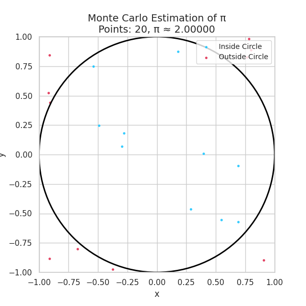
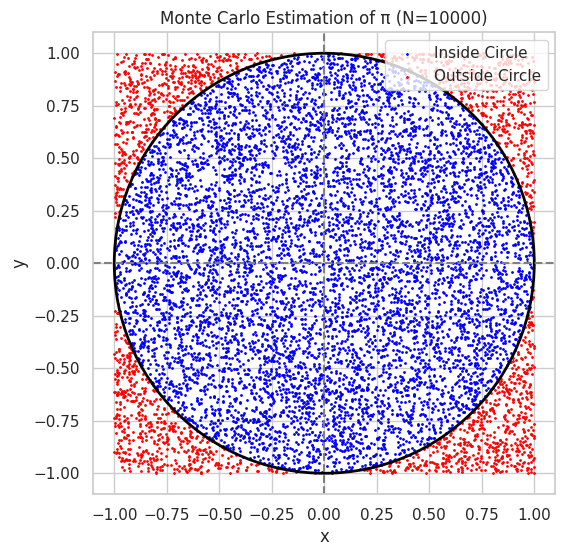
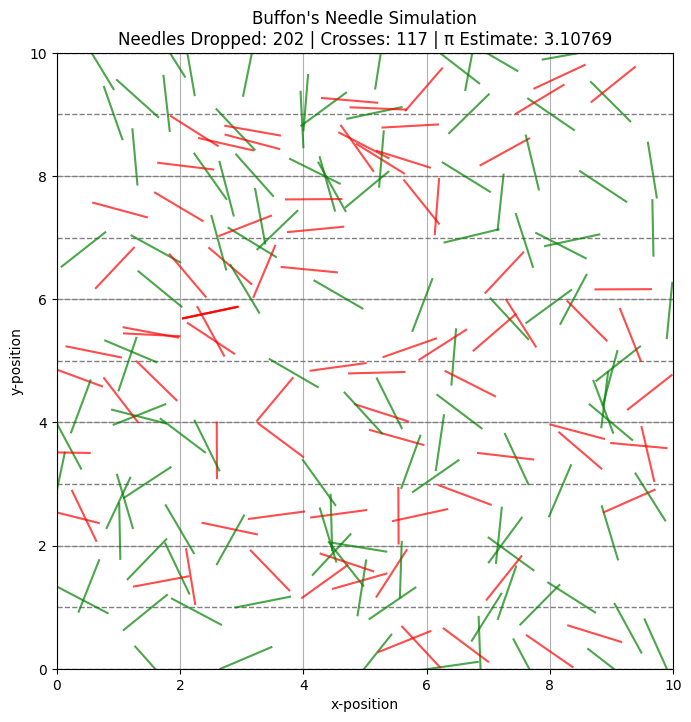

# Problem 2

# 🧠 Estimating π Using Monte Carlo Simulation (Circle Method)

## 1. 🎓 Theoretical Foundation

Monte Carlo methods estimate values using random sampling and probabilistic principles. In this method, we use a **unit circle** inscribed in a **square** to estimate the value of π.

### 🔷 Geometric Principle

- Consider a **unit circle** of radius 1 centered at the origin.
- Enclose it in a **square** with side length 2 (ranging from -1 to 1 on both x and y axes).
- Generate random points $(x, y)$ uniformly inside the square.
- Count how many points fall **inside the circle** using the condition:

$$
x^2 + y^2 \leq 1
$$

- The area of the circle is:

$$
A_{\text{circle}} = \pi r^2 = \pi \cdot 1^2 = \pi
$$

- The area of the square is:

$$
A_{\text{square}} = (2r)^2 = 4
$$

- The ratio of the areas gives the **probability** that a random point falls inside the circle:

$$
\frac{\text{Points inside circle}}{\text{Total points}} \approx \frac{\pi}{4}
$$

- Solving for π:

$$
\pi \approx 4 \cdot \frac{\text{Points inside circle}}{\text{Total points}}
$$

---

## 2. 🧪 Simulation



---



---

Below is the Python code to implement this method and estimate the value of π.

```python
import numpy as np
import matplotlib.pyplot as plt

# Number of random points
N = 10000

# Generate N random points in the square [-1, 1] x [-1, 1]
x = np.random.uniform(-1, 1, N)
y = np.random.uniform(-1, 1, N)

# Compute distance from origin for each point
distance_squared = x**2 + y**2

# Count how many points fall inside the unit circle
inside_circle = distance_squared <= 1
count_inside = np.sum(inside_circle)

# Estimate π
pi_estimate = 4 * count_inside / N
print(f"Estimated π ≈ {pi_estimate}")

# Visualization
plt.figure(figsize=(6,6))
plt.scatter(x[inside_circle], y[inside_circle], color='blue', s=1, label='Inside Circle')
plt.scatter(x[~inside_circle], y[~inside_circle], color='red', s=1, label='Outside Circle')
circle = plt.Circle((0, 0), 1, color='black', fill=False, linewidth=2)
plt.gca().add_patch(circle)
plt.axhline(0, color='gray', linestyle='--')
plt.axvline(0, color='gray', linestyle='--')
plt.gca().set_aspect('equal')
plt.title(f"Monte Carlo Estimation of π (N={N})")
plt.legend()
plt.xlabel("x")
plt.ylabel("y")
plt.grid(True)
plt.show()
```
---

```python
import numpy as np
import matplotlib.pyplot as plt
from matplotlib.animation import FuncAnimation, PillowWriter
from IPython.display import Image, display

# Generate N random points
N = 1000
step = 10  # number of points added per frame

x = np.random.uniform(-1, 1, N)
y = np.random.uniform(-1, 1, N)
distance_squared = x**2 + y**2
inside_circle = distance_squared <= 1

# Setup figure
fig, ax = plt.subplots(figsize=(6, 6))
sc_inside = ax.scatter([], [], color='deepskyblue', s=6, alpha=0.7, label='Inside Circle')
sc_outside = ax.scatter([], [], color='crimson', s=6, alpha=0.7, label='Outside Circle')

# Add unit circle
circle = plt.Circle((0, 0), 1, color='black', fill=False, linewidth=2)
ax.add_patch(circle)

# Format plot
ax.set_xlim(-1, 1)
ax.set_ylim(-1, 1)
ax.set_aspect('equal')
ax.set_xlabel("x", fontsize=12)
ax.set_ylabel("y", fontsize=12)
ax.set_title("Monte Carlo Estimation of π", fontsize=14)
ax.legend(loc='upper right', fontsize=10)
ax.grid(True)

# Update function for animation
def update(frame):
    idx = (frame + 1) * step
    x_in = x[inside_circle][:idx]
    y_in = y[inside_circle][:idx]
    x_out = x[~inside_circle][:idx]
    y_out = y[~inside_circle][:idx]
    
    sc_inside.set_offsets(np.column_stack((x_in, y_in)))
    sc_outside.set_offsets(np.column_stack((x_out, y_out)))
    
    total = len(x_in) + len(x_out)
    pi_estimate = 4 * len(x_in) / total if total > 0 else 0
    ax.set_title(f"Monte Carlo Estimation of π\nPoints: {total}, π ≈ {pi_estimate:.5f}", fontsize=14)

# Create animation
frames = N // step
ani = FuncAnimation(fig, update, frames=frames, interval=50, repeat=False)

# Save the animation as a GIF
ani.save("monte_carlo_pi.gif", writer=PillowWriter(fps=20))

# Display the GIF inline
display(Image(filename="monte_carlo_pi.gif"))
```
---

## ✅ Summary

- We used **uniform random sampling** within a square to approximate the value of π.
- The **ratio of points inside the circle** to the total number gives us a way to estimate π using:

$$
\pi \approx 4 \cdot \frac{\text{Points inside}}{\text{Total points}}
$$

- Increasing the number of points improves the accuracy due to the **law of large numbers**.


# 🧠 Theoretical Foundation: Buffon’s Needle Problem

## 📖 Problem Setup

Buffon’s Needle is a classic probability problem posed by Georges-Louis Leclerc, Comte de Buffon in the 18th century. It presents a simple yet profound way to estimate the value of $\pi$ using randomness and geometry.

- Imagine a plane with **equally spaced parallel lines** a distance $t$ apart.
- A needle of length $L$ (where $L \leq t$) is randomly dropped onto this plane.
- We repeat this process $N$ times and observe how many times the needle crosses a line.

This stochastic process can be used to estimate the value of $\pi$ based on the **probability of a crossing**.

---

## 🧮 Derivation of the Formula

Let:
- $L$ = length of the needle  
- $t$ = distance between lines (assume $L \leq t$)  
- $N$ = number of needle drops  
- $C$ = number of times the needle crosses a line  

The **probability** that a single needle will cross a line is given by:

$$
P = \frac{2L}{t\pi}
$$

Hence, if we drop $N$ needles and observe $C$ crossings, we estimate $P \approx \frac{C}{N}$. Rearranging the equation to solve for $\pi$:

$$
\pi \approx \frac{2L \cdot N}{t \cdot C}
$$

---

## 🛠️ Simulation Steps

To perform the Monte Carlo simulation of Buffon’s Needle:

1. **Randomly drop $N$ needles**:
- For each needle, generate:
- A random distance from the center of the needle to the nearest line:  
$$
y \in [0, t/2]
$$
- A random angle $\theta$ between the needle and the parallel lines:  
$$
\theta \in [0, \pi/2]
$$

2. **Determine if a needle crosses a line**:
- A needle crosses a line if the vertical projection from its center exceeds $y$, i.e.:
$$
\frac{L}{2} \sin(\theta) \geq y
$$

3. **Count the number of crossings** $C$.

4. **Estimate $\pi$** using the derived formula:
$$
\pi \approx \frac{2L \cdot N}{t \cdot C}
$$

---

## 📌 Important Notes

- For accurate results, ensure $L \leq t$.
- The larger the number of trials $N$, the more accurate the approximation of $\pi$ becomes.
- Buffon's Needle illustrates the deep connection between **geometry**, **probability**, and **mathematical constants** like $\pi$.


# 🎨 Visualization of Buffon's Needle Simulation


---



---

```python
import numpy as np
import matplotlib.pyplot as plt
import matplotlib.animation as animation
from matplotlib.animation import PillowWriter

# Parameters
L = 0.9        # Needle length
t = 1.0        # Distance between lines
N = 200        # Number of needle drops
line_count = 10  # Number of parallel lines

# Generate random needle centers and angles
x_centers = np.random.uniform(0, line_count, N)
y_centers = np.random.uniform(0, line_count, N)
angles = np.random.uniform(0, np.pi, N)

# Calculate needle endpoints
dx = (L / 2) * np.cos(angles)
dy = (L / 2) * np.sin(angles)
x1 = x_centers - dx
x2 = x_centers + dx
y1 = y_centers - dy
y2 = y_centers + dy

# Determine crossings
crossings = (np.floor(y1 / t) != np.floor(y2 / t))

# Set up figure and axes
fig, ax = plt.subplots(figsize=(8, 8))

# Initialize plot
def init():
    ax.set_xlim(0, line_count)
    ax.set_ylim(0, line_count)
    ax.set_aspect('equal')
    ax.set_xlabel("x-position")
    ax.set_ylabel("y-position")
    ax.set_title("Buffon's Needle Simulation\nGreen = Crosses Line, Red = Doesn't Cross", fontsize=14)
    ax.grid(True)
    for i in range(line_count + 1):
        ax.axhline(i * t, color='gray', linestyle='--', linewidth=1)
    return []

# Update function for animation
def update(frame):
    color = 'green' if crossings[frame] else 'red'
    ax.plot([x1[frame], x2[frame]], [y1[frame], y2[frame]], color=color, alpha=0.7)
    return []

# Create animation
ani = animation.FuncAnimation(fig, update, frames=N, init_func=init, blit=False, interval=50, repeat=False)

# Save as GIF
gif_path = "/content/buffon_simulation.gif"
ani.save(gif_path, writer=PillowWriter(fps=20))

print("GIF saved to:", gif_path)
```

---


## 🖼️ Geometric Representation

To visually understand how Buffon’s Needle estimates π, we simulate and plot:

- **Equally spaced parallel lines** a distance $t$ apart, running horizontally.
- **Randomly dropped needles**, each with:
  - A center point $(x, y)$ within the simulation area.
  - A random orientation angle $\theta$.
  - Two endpoints computed using:
$$
\text{end}_1 = \left(x - \frac{L}{2} \cos\theta,\ y - \frac{L}{2} \sin\theta\right)
$$
$$
\text{end}_2 = \left(x + \frac{L}{2} \cos\theta,\ y + \frac{L}{2} \sin\theta\right)
$$

## 🔍 Visual Features

- **Parallel lines**: drawn as horizontal gray or black lines at $y = nt$ for integer $n$.
- **Needles that cross a line**:
  - Highlighted in **green**.
- **Needles that do not cross**:
  - Shown in **red** or another contrasting color.
- Use **alpha transparency** and **thin lines** to reduce visual clutter.

---

# 📊 Analysis of Estimation Accuracy

## 📈 Effect of Number of Drops ($N$)

As with many Monte Carlo methods, the accuracy of the π estimate improves with more trials:

- For small $N$, the estimate fluctuates significantly due to randomness.
- For large $N$, the estimate **converges slowly** toward the true value of $\pi$.
- The convergence is **statistical** and exhibits **variance**, roughly decreasing with:
$$
\text{Error} \propto \frac{1}{\sqrt{N}}
 $$

## 🔁 Comparison to Circle-Based Monte Carlo

| Feature                   | Buffon’s Needle                    | Circle Method                        |
|---------------------------|------------------------------------|--------------------------------------|
| Geometry                  | Lines and needles                  | Square and inscribed circle          |
| π Formula                 | $\pi \approx \frac{2L \cdot N}{t \cdot C}$ | $\pi \approx 4 \cdot \frac{\text{points inside circle}}{\text{total points}}$ |
| Convergence Rate          | Slow                               | Moderate                             |
| Visual Intuition          | Strong                             | Very strong                          |
| Computational Simplicity  | Moderate                           | High                                 |
| Accuracy (at same $N$)    | Typically lower                    | Typically higher                     |

## 📌 Recommendations

- Use Buffon’s method to teach **geometric probability**.
- For practical Monte Carlo π estimation, prefer the **circle method** for faster convergence and simpler implementation.
- Combine visual outputs with **π vs. $N$ convergence plots** for deeper insight.

---

## 📉 Optional Extensions

- Plot a curve showing $\pi$ estimates as a function of $N$.
- Overlay a line showing the true value $\pi \approx 3.14159$ for visual comparison.
- Compute standard deviation of estimates over multiple runs.

